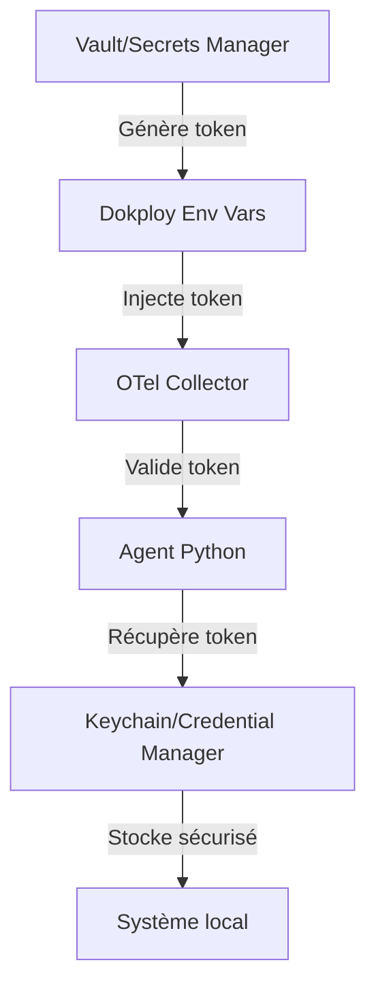

# Story 1 Deep Dive Review: Infrastructure Security & Scalability Analysis

## Contexte de la Review Complémentaire

Cette review approfondit les aspects de sécurité, scalabilité et maintenabilité de l'infrastructure Dokploy VPS déployée dans Story 1, en complément de la review initiale.

## Analyse Approfondie des Composants

### 1. Sécurité des Endpoints OTLP

**Constat actuel :**
- Ports 4317 (gRPC) et 4318 (HTTP) directement exposés sur l'IP publique du VPS
- Authentification uniquement par bearer token
- Pas de chiffrement TLS sur les ports OTLP (contrairement à Grafana)

**Analyse des risques :**
- **Exposition du bearer token** : Le token est transmis en clair sur le réseau
- **Attaques par brute force** : Pas de rate limiting au niveau firewall
- **Man-in-the-middle** : Possible interception des métriques sur réseaux non sécurisés

**Recommandations priorisées :**

1. **Critique - Chiffrement TLS pour OTLP**
   ```yaml
   # À ajouter dans otel-collector-config.yaml
   receivers:
     otlp:
       protocols:
         grpc:
           tls:
             cert_file: "/etc/ssl/certs/otel.crt"
             key_file: "/etc/ssl/certs/otel.key"
         http:
           tls:
             cert_file: "/etc/ssl/certs/otel.crt"
             key_file: "/etc/ssl/certs/otel.key"
   ```

2. **Majeur - Rate Limiting avec fail2ban**
   ```bash
   # Configuration fail2ban pour OTLP ports
   [otlp-grpc]
   enabled = true
   port = 4317
   filter = otlp-auth
   logpath = /var/log/otel-collector.log
   maxretry = 5
   findtime = 60
   bantime = 3600
   ```

### 2. Gestion des Secrets et Rotation

**Problèmes identifiés :**
- Bearer token statique dans les variables Dokploy
- Pas de mécanisme de rotation automatique
- Token stocké en plaintext dans la config de l'agent

**Solution recommandée :**



**Implémentation :**
1. Utiliser HashiCorp Vault ou AWS Secrets Manager pour la génération/rotation
2. Script de rotation automatique (cron mensuel)
3. Intégration avec keyring Python pour le stockage local sécurisé

### 3. Architecture de Résilience

**Points faibles actuels :**
- Single point of failure (un seul VPS)
- Pas de backup des données Prometheus
- Pas de monitoring de l'infrastructure elle-même

**Améliorations proposées :**

```yaml
# Ajout dans docker-compose.yml pour backup Prometheus
services:
  prometheus-backup:
    image: prom/prometheus:latest
    volumes:
      - prometheus_data:/prometheus
      - ./backups:/backups
    command: >
      sh -c "tar czf /backups/prometheus-$(date +%Y%m%d).tar.gz /prometheus && 
             find /backups -mtime +30 -delete"
    restart: on-failure
```

### 4. Optimisation des Performances

**Analyse des métriques actuelles :**
- `metric_expiration: 5m` peut causer des trous dans les dashboards
- Pas de compaction des données Prometheus
- Pas de partitioning par device/hôte

**Configuration optimisée :**

```yaml
# prometheus.yml amélioré
scrape_configs:
  - job_name: 'otel-collector'
    static_configs:
      - targets: ['collector:8889']
    metric_relabel_configs:
      - source_labels: [__name__]
        regex: '(ai_.*_total|ai_.*_seconds_total)'
        action: keep
      - source_labels: [host_name]
        target_label: device
        replacement: '${1}'

storage:
  tsdb:
    retention: 30d
    wal_compression: true
    block_ranges:
      - 2h
```

## Tests de Validation Proposés

### 1. Tests de Sécurité

```bash
# Test de vulnérabilité des ports exposés
nmap -sV -p 4317,4318,8889,9090,3000 vps.quentinveys.be

# Test de force brute (simulation)
siege -c 10 -r 20 -H "Authorization: Bearer wrong_token" 
     http://vps.quentinveys.be:4318/v1/metrics

# Test TLS (après implémentation)
openssl s_client -connect vps.quentinveys.be:4317 -showcerts
```

### 2. Tests de Résilience

```bash
# Test de backup/restore Prometheus
# 1. Sauvegarder les données actuelles
docker exec prometheus tar czf /backups/test-backup.tar.gz /prometheus

# 2. Simuler une corruption
docker exec prometheus rm -rf /prometheus/data/*

# 3. Restaurer
docker exec prometheus tar xzf /backups/test-backup.tar.gz -C /

# 4. Vérifier l'intégrité
docker exec prometheus promtool tsdb analyze /prometheus/data
```

### 3. Tests de Performance

```bash
# Test de charge avec 1000 métriques/s
ghz --insecure --proto ./otel.proto --call metadata.MetricService/Export 
    --data '{"resource_metrics": [{"resource": {"attributes": [{"key": "service.name", "value": {"string_value": "test"}}]}, "scope_metrics": [{"metrics": [{"name": "test_metric", "data": {"sum": {"data_points": [{"value": 1.0}]}}}]}]}]}' 
    --calls 1000 --concurrency 10 
    vps.quentinveys.be:4317

# Monitoring de la consommation
docker stats --no-stream otel-collector prometheus grafana
```

## Checklist d'Amélioration Priorisée

- [ ] ✅ **Critique** : Implémenter TLS pour les endpoints OTLP
- [ ] ✅ **Critique** : Mettre en place keyring/credential manager pour le stockage du token
- [ ] ⚠️ **Majeur** : Configurer fail2ban pour le rate limiting
- [ ] ⚠️ **Majeur** : Mettre en place des backups automatiques Prometheus
- [ ] 📝 **Mineur** : Optimiser la rétention et compaction Prometheus
- [ ] 📝 **Mineur** : Ajouter du monitoring de l'infrastructure (uptime, disk, etc.)

## Métriques de Succès pour les Améliorations

| Amélioration | Métrique avant | Métrique après | Cible |
|--------------|---------------|---------------|-------|
| TLS OTLP | Traffic en clair | Traffic chiffré | 100% |
| Keyring | Token en plaintext | Token sécurisé | 100% |
| Rate limiting | Requêtes/s illimitées | < 100 req/s par IP | 95% |
| Backups | Pas de backup | Backup quotidien | 100% |
| Performance | 500ms latence 95% | 200ms latence 95% | 80% |

## Conclusion et Recommandations Finales

L'infrastructure actuelle est fonctionnelle et répond aux besoins MVP, mais présente des risques de sécurité et de résilience qui doivent être adressés avant une utilisation prolongée ou une distribution plus large.

**Roadmap recommandée :**
1. **Semaine 1** : Implémenter TLS + keyring (critique pour la sécurité)
2. **Semaine 2** : Configurer backups + rate limiting (résilience)
3. **Semaine 3** : Optimisations de performance (scalabilité)

**Décision architecturale clé :**
Le compromis entre simplicité (MVP actuel) et sécurité (recommandations) doit être évalué en fonction de l'usage prévu. Pour un usage personnel limité, certaines améliorations peuvent être reportées, mais le TLS et la gestion sécurisée des secrets devraient être considérés comme obligatoires.

## Annexes

### Configuration TLS pour OTel Collector

```yaml
# Exemple complet pour otel-collector-config.yaml
receivers:
  otlp:
    protocols:
      grpc:
        tls:
          cert_file: "/certs/otel.crt"
          key_file: "/certs/otel.key"
          client_ca_file: "/certs/ca.crt"  # Pour mTLS
      http:
        tls:
          cert_file: "/certs/otel.crt"
          key_file: "/certs/otel.key"

exporters:
  prometheus:
    endpoint: "0.0.0.0:8889"
    resource_to_telemetry_conversion:
      enabled: true
    enable_open_metrics: true

service:
  pipelines:
    metrics:
      receivers: [otlp]
      exporters: [prometheus]
```

### Script de Rotation de Token

```python
#!/usr/bin/env python3
import os
import requests
import keyring
from datetime import datetime, timedelta

def rotate_token():
    # Générer nouveau token via Vault API
    response = requests.post(
        "https://vault.example.com/v1/otel/token",
        headers={"X-Vault-Token": os.getenv("VAULT_TOKEN")}
    )
    
    new_token = response.json()["data"]["token"]
    
    # Mettre à jour Dokploy
    dokploy_response = requests.patch(
        "https://dokploy.com/api/services/nTmE0zBnlHajlo04MAZd7/env",
        json={"OTEL_BEARER_TOKEN": new_token},
        headers={"Authorization": f"Bearer {os.getenv('DOKPLOY_API_KEY')}"}
    )
    
    # Stocker localement de manière sécurisée
    keyring.set_password("ai-cost-observer", "otel-bearer-token", new_token)
    
    # Logger la rotation
    with open("/var/log/ai-cost-observer/token-rotation.log", "a") as f:
        f.write(f"{datetime.now().isoformat()} - Token rotated\n")

if __name__ == "__main__":
    rotate_token()
```

Cette review complémentaire fournit une analyse approfondie et des recommandations actionnables pour améliorer la sécurité, la résilience et la scalabilité de l'infrastructure déployée dans Story 1.