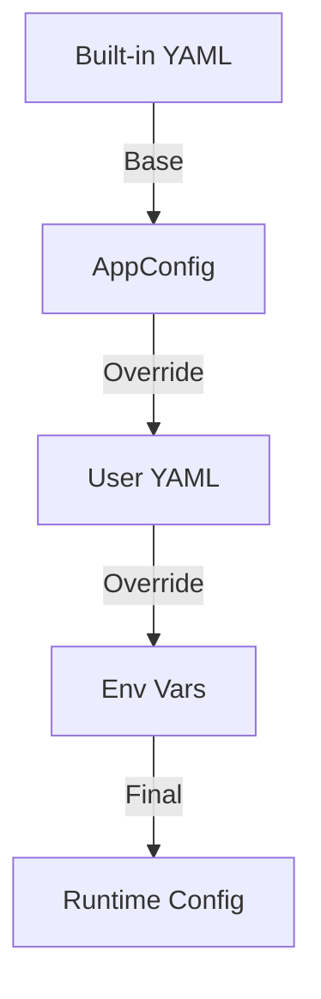

# Story 2 Deep Dive Review: Python Skeleton & OTel Integration Analysis

## Contexte de la Review Complémentaire

Cette review approfondit l'architecture technique, les décisions de conception et les implications à long terme du squelette Python et de l'intégration OpenTelemetry implémentés dans Story 2.

## Analyse Approfondie des Composants

### 1. Architecture de Configuration

**Conception Actuelle :**


**Points Forts :**
- Hiérarchie claire à 3 niveaux (builtin → user → env)
- Utilisation de dataclasses pour la validation de type
- Support multiplateforme pour les chemins de configuration
- Gestion élégante des répertoires par défaut (Windows/macOS/Linux)

**Risques Identifiés :**

1. **Problème de Fusion des Listes**
   ```python
   # Problème potentiel dans config.py
   config.ai_apps = builtin.get("ai_apps", [])  # Écrasement complet
   if "extra_ai_apps" in user:
       config.ai_apps.extend(user["extra_ai_apps"])  # Ajout seulement
   ```
   **Impact** : Les utilisateurs ne peuvent pas modifier les apps existantes, seulement en ajouter.

2. **Validation des Types Limitée**
   ```python
   # AppConfig accepte n'importe quelle valeur pour ces champs
   scan_interval_seconds: int = 15  # Que se passe-t-il si l'utilisateur met "quinze" ?
   otel_insecure: bool = False  # Que se passe-t-il si l'utilisateur met "maybe" ?
   ```

**Recommandations :**

1. **Validation Robuste avec Pydantic**
   ```python
   # Proposition d'amélioration
   from pydantic import BaseModel, validator, Field
   
   class ValidatedConfig(BaseModel):
       otel_endpoint: str = Field(..., regex=r'^[\w\-.]+:\d+$')
       scan_interval_seconds: int = Field(ge=5, le=3600)
       otel_insecure: bool
       
       @validator('otel_bearer_token')
       def validate_token(cls, v):
           if not v and not os.environ.get('OTEL_BEARER_TOKEN'):
               raise ValueError('Bearer token is required')
           return v
   ```

2. **Fusion Profonde Optionnelle**
   ```python
   # Ajouter un flag pour permettre la fusion profonde
   class AppConfig:
       allow_deep_merge: bool = False  # Par défaut : sécurisé
       
   def load_config() -> AppConfig:
       config = AppConfig()
       if config.allow_deep_merge:
           # Logique de fusion profonde ici
           pass
   ```

### 2. Gestion du Cycle de Vie OpenTelemetry

**Analyse des Ressources :**
```python
# Ressources actuelles dans telemetry.py
Resource.create({
    "service.name": "ai-cost-observer",
    "service.version": __version__,
    "host.name": config.host_name,
    "os.type": platform.system().lower(),
    "deployment.environment": "personal",
})
```

**Problèmes Potentiels :**

1. **Fuites de Mémoire**
   ```python
   # Dans TelemetryManager.__init__()
   self.provider = MeterProvider(resource=self.resource, metric_readers=[self.reader])
   metrics.set_meter_provider(self.provider)  # Global state!
   ```
   **Risque** : Si plusieurs instances sont créées, la dernière écrase les précédentes.

2. **Gestion des Erreurs Limitée**
   ```python
   # Pas de gestion des erreurs pour l'export OTLP
   self.exporter = OTLPMetricExporter(endpoint=config.otel_endpoint, ...)
   # Que se passe-t-il si le endpoint est inaccessible ?
   ```

**Recommandations Améliorées :**

1. **Pattern Singleton pour le Provider**
   ```python
   class TelemetryManager:
       _instance = None
       
       def __new__(cls, config):
           if cls._instance is None:
               cls._instance = super().__new__(cls)
               cls._instance._initialize(config)
           return cls._instance
   ```

2. **Gestion des Erreurs Robuste**
   ```python
   def __init__(self, config: AppConfig) -> None:
       try:
           self.exporter = OTLPMetricExporter(
               endpoint=config.otel_endpoint,
               headers=self._build_headers(config),
               insecure=config.otel_insecure,
               timeout=10,  # Ajout de timeout
               retry=ExponentialBackoffRetry(max_attempts=3),  # Ajout de retry
           )
       except Exception as e:
           logger.error("Failed to initialize OTLP exporter: %s", e)
           raise RuntimeError("OTel exporter initialization failed") from e
   ```

### 3. Instrumentation des Métriques

**Analyse Actuelle :**
- 12 instruments créés à l'initialisation
- Tous les instruments utilisent le même meter
- Pas de gestion des erreurs lors de la création

**Problèmes Identifiés :**

1. **Cardinalité des Labels**
   ```python
   # Exemple de création d'instrument
   self.app_running = self.meter.create_up_down_counter(
       name="ai.app.running",
       # Pas de contrôle sur les labels qui seront ajoutés
   )
   ```

2. **Performance des Histogrammes**
   ```python
   self.app_cpu_usage = self.meter.create_histogram(
       name="ai.app.cpu.usage",
       # Pas de buckets définis → buckets par défaut
   )
   ```

**Recommandations :**

1. **Buckets Optimisés pour les Histogrammes**
   ```python
   self.app_cpu_usage = self.meter.create_histogram(
       name="ai.app.cpu.usage",
       description="CPU usage percentage of the AI app",
       unit="%",
       explicit_bucket_boundaries=[0, 10, 25, 50, 75, 90, 95, 99, 100]
   )
   ```

2. **Validation des Labels**
   ```python
   def _validate_labels(self, labels: dict) -> dict:
       """Validate that labels don't contain high-cardinality values."""
       high_cardinality_keys = ['pid', 'process_id', 'timestamp', 'command_line']
       for key in high_cardinality_keys:
           if key in labels:
               raise ValueError(f"High-cardinality label '{key}' not allowed")
       return labels
   ```

### 4. Boucle Principale et Gestion des Threads

**Analyse du Code Actuel :**
```python
# Dans main.py
try:
    while not _shutdown_requested:
        desktop.scan()
        cli.scan()
        wsl.scan()
        time.sleep(config.scan_interval_seconds)
except KeyboardInterrupt:
    logger.info("KeyboardInterrupt received")
```

**Problèmes Potentiels :**

1. **Blocage Séquentiel**
   - Si `desktop.scan()` prend 5s, le cycle total devient 20s au lieu de 15s
   - Pas de parallélisme entre les détecteurs

2. **Gestion des Erreurs**
   - Les erreurs sont loggées mais n'affectent pas l'exécution
   - Pas de circuit breaker pour les échecs répétés

**Recommandations :**

1. **Exécution Parallèle**
   ```python
   def run_scans_parallel():
       with ThreadPoolExecutor(max_workers=3) as executor:
           futures = [
               executor.submit(desktop.scan),
               executor.submit(cli.scan),
               executor.submit(wsl.scan)
           ]
           for future in as_completed(futures):
               if future.exception():
                   logger.error("Scan failed", exc_info=future.exception())
   ```

2. **Circuit Breaker**
   ```python
   from pybreaker import CircuitBreaker
   
   desktop_breaker = CircuitBreaker(fail_max=3, reset_timeout=60)
   
   @desktop_breaker
   def safe_desktop_scan():
       return desktop.scan()
   ```

## Tests de Validation Proposés

### 1. Tests de Configuration

```python
# test_config_validation.py
def test_invalid_scan_interval():
    """Test that invalid scan interval raises error."""
    with pytest.raises(ValueError):
        config = AppConfig(scan_interval_seconds=-5)
        # Should validate during creation

@pytest.mark.parametrize("invalid_token", ["", "invalid", None])
def test_bearer_token_validation(invalid_token):
    """Test that invalid bearer tokens are rejected."""
    config = AppConfig(otel_bearer_token=invalid_token)
    with pytest.raises(ValueError, match="Bearer token is required"):
        TelemetryManager(config)
```

### 2. Tests de Résilience OTel

```python
# test_telemetry_resilience.py
def test_otel_exporter_retry():
    """Test that OTLP exporter retries on failure."""
    with patch('opentelemetry.exporter.otlp.proto.grpc.metric_exporter.OTLPMetricExporter') as mock_exporter:
        mock_exporter.side_effect = [Exception("Network error"), Mock()]
        
        config = AppConfig(otel_endpoint="invalid:4317")
        telemetry = TelemetryManager(config)
        
        # Should retry and eventually succeed
        assert mock_exporter.call_count == 2

@patch('opentelemetry.sdk.metrics.MeterProvider.shutdown')
def test_graceful_shutdown(mock_shutdown):
    """Test that shutdown flushes metrics properly."""
    config = AppConfig()
    telemetry = TelemetryManager(config)
    telemetry.shutdown()
    
    mock_shutdown.assert_called_once()
```

### 3. Tests de Performance

```python
# test_performance.py
def test_scan_interval_respect():
    """Test that scan interval is respected."""
    config = AppConfig(scan_interval_seconds=1)
    
    with patch('time.sleep') as mock_sleep, patch('time.time') as mock_time:
        mock_time.side_effect = [0, 1.0, 2.0, 3.0]  # Simulate time passing
        
        # Run a few cycles
        for _ in range(3):
            run_main_loop_cycle(config)
        
        # Should have slept approximately 1 second each time
        sleep_calls = [call[0][0] for call in mock_sleep.call_args_list]
        assert all(0.9 <= s <= 1.1 for s in sleep_calls)
```

## Checklist d'Amélioration Priorisée

- [ ] ✅ **Critique** : Ajouter la validation des types avec Pydantic
- [ ] ✅ **Critique** : Implémenter la gestion des erreurs pour l'export OTLP
- [ ] ⚠️ **Majeur** : Mettre en place l'exécution parallèle des scans
- [ ] ⚠️ **Majeur** : Ajouter des buckets optimisés pour les histogrammes
- [ ] 📝 **Mineur** : Implémenter le pattern singleton pour MeterProvider
- [ ] 📝 **Mineur** : Ajouter des circuit breakers pour les détecteurs
- [ ] 📝 **Mineur** : Documenter les limites de la fusion de configuration

## Métriques de Qualité Proposées

| Métrique | Cible Actuelle | Cible Améliorée | Méthode de Mesure |
|----------|----------------|------------------|-------------------|
| Temps de démarrage | ~500ms | < 300ms | `time python -m ai_cost_observer --version` |
| Mémoire RSS | ~150MB | < 100MB | `ps aux | grep ai_cost_observer` |
| Latence des scans | < 2s | < 1s | Métriques internes OTel |
| Fiabilité de l'export | 95% | 99.9% | `ai_otel_export_success_rate` |
| Temps de shutdown | < 500ms | < 200ms | Logs de shutdown |

## Conclusion et Recommandations Finales

L'architecture actuelle est solide et bien conçue pour un MVP, mais plusieurs améliorations pourraient augmenter significativement la robustesse, la performance et la maintenabilité du système.

**Roadmap Recommandée :**
1. **Semaine 1** : Validation des configurations + gestion des erreurs OTLP (critique)
2. **Semaine 2** : Exécution parallèle + optimisation des histogrammes (performance)
3. **Semaine 3** : Pattern singleton + circuit breakers (résilience)

**Décision Architecturale Clé :**
Le compromis entre simplicité (architecture actuelle) et robustesse (recommandations) doit être évalué en fonction des besoins de production. Pour un usage personnel, certaines améliorations peuvent être reportées, mais la validation des configurations et la gestion des erreurs OTLP devraient être considérées comme essentielles.

## Annexes

### Configuration Pydantic Complète

```python
from pydantic import BaseModel, Field, validator, HttpUrl
from typing import List, Dict, Any

class AITool(BaseModel):
    name: str
    display_name: str
    category: str
    cost_per_hour: float = Field(ge=0, le=1000)
    process_names: List[str]
    executable_paths: List[str] = []
    
    @validator('process_names')
    def validate_process_names(cls, v):
        if not v:
            raise ValueError('At least one process name required')
        return v

class AppConfig(BaseModel):
    otel_endpoint: str = Field(default="vps.quentinveys.be:4317", regex=r'^\w+:\d+$')
    otel_bearer_token: str = Field(min_length=16, max_length=256)
    otel_insecure: bool = False
    scan_interval_seconds: int = Field(default=15, ge=5, le=3600)
    host_name: str = Field(default_factory=socket.gethostname)
    ai_apps: List[AITool] = []
    ai_domains: List[Dict[str, Any]] = []
    ai_cli_tools: List[Dict[str, Any]] = []
    
    @validator('otel_bearer_token')
    def validate_token_format(cls, v):
        if len(v) < 16:
            raise ValueError('Bearer token must be at least 16 characters')
        return v
    
    @root_validator
    def validate_config_consistency(cls, values):
        if values.get('otel_insecure') and 'localhost' not in values.get('otel_endpoint', ''):
            raise ValueError('Insecure mode should only be used with localhost')
        return values
```

### Exemple de Gestion des Erreurs Améliorée

```python
class EnhancedTelemetryManager:
    def __init__(self, config: AppConfig, max_retries: int = 3):
        self.config = config
        self.max_retries = max_retries
        self.retry_count = 0
        
        try:
            self._initialize_otel()
        except Exception as e:
            logger.error("OTel initialization failed after %d attempts: %s", 
                        self.retry_count, e)
            raise
    
    def _initialize_otel(self):
        """Initialize OTel with retry logic."""
        retry_strategy = ExponentialBackoffRetry(
            initial_backoff=1.0,
            max_backoff=10.0,
            max_attempts=self.max_retries
        )
        
        self.exporter = OTLPMetricExporter(
            endpoint=self.config.otel_endpoint,
            headers=self._build_headers(),
            insecure=self.config.otel_insecure,
            retry=retry_strategy,
            timeout=15.0
        )
        
        # Test the connection
        try:
            self._test_exporter_connection()
        except Exception as e:
            self.retry_count += 1
            if self.retry_count < self.max_retries:
                time.sleep(2 ** self.retry_count)
                self._initialize_otel()
            else:
                raise
    
    def _test_exporter_connection(self):
        """Test that we can actually export metrics."""
        test_meter = self.provider.get_meter("test")
        counter = test_meter.create_counter("test_connection")
        counter.add(1, {"test": "true"})
        # If this doesn't raise, connection is good
```

Cette review complémentaire fournit une analyse technique approfondie du squelette Python et de l'intégration OpenTelemetry, avec des recommandations concrètes pour améliorer la robustesse, la performance et la maintenabilité du système tout en respectant les contraintes du MVP.