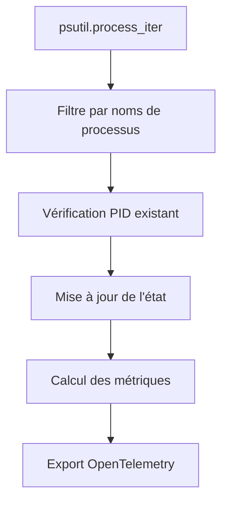
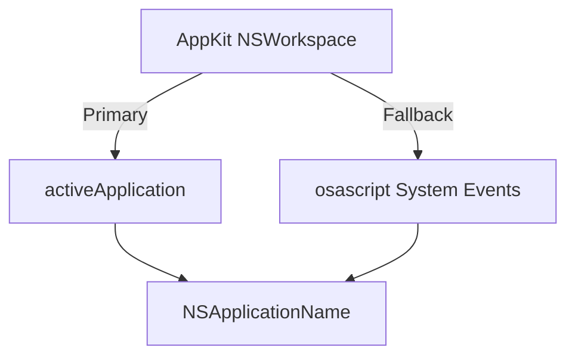

# Story 3 Deep Dive Review: Desktop App Detection Analysis

## Contexte de la Review Complémentaire

Cette review approfondit l'architecture technique, les algorithmes de détection, et les implications de performance du système de détection des applications desktop implémenté dans Story 3.

## Analyse Approfondie des Composants

### 1. Architecture de Détection des Processus

**Flux de Détection Actuel :**


**Points Forts :**
- Approche stateful avec suivi des PIDs entre les scans
- Gestion robuste des erreurs psutil (NoSuchProcess, AccessDenied, ZombieProcess)
- Utilisation de `time.monotonic()` pour les calculs de durée
- Séparation claire entre détection et télémétrie

**Problèmes Identifiés :**

1. **Double Scan Innécessaire**
   ```python
   # Dans main.py - deux scans indépendants
   desktop.scan()  # Scan complet de tous les processus
   cli.scan()     # Autre scan complet
   ```
   **Impact** : 2x le temps CPU et la consommation mémoire

2. **Premier Appel cpu_percent() Toujours 0**
   ```python
   cpu = proc.cpu_percent(interval=0)  # Toujours 0 au premier appel
   ```
   **Impact** : Métriques CPU incorrectes pour les nouveaux processus

3. **Pas de Cache des Noms de Processus**
   ```python
   proc_name_lower = proc.info["name"].lower()  # Appelé à chaque scan
   ```
   **Impact** : Opération de mise en minuscule répétée inutilement

**Recommandations :**

1. **Snapshot Partagé des Processus**
   ```python
   # Dans main.py
   def run():
       # Créer un snapshot unique
       process_snapshot = list(psutil.process_iter(["pid", "name"]))
       
       # Passer le snapshot aux détecteurs
       desktop.scan(process_snapshot)
       cli.scan(process_snapshot)
   ```

2. **Cache des Noms Normalisés**
   ```python
   class DesktopDetector:
       def __init__(self):
           self._normalized_cache = {}
       
       def _get_normalized(self, name):
           if name not in self._normalized_cache:
               self._normalized_cache[name] = name.lower()
           return self._normalized_cache[name]
   ```

3. **Stratégie CPU Améliorée**
   ```python
   # Utiliser un intervalle minimal pour les nouveaux processus
   if proc.info["pid"] not in self._seen_pids:
       cpu = proc.cpu_percent(interval=0.1)  # Bloquant 100ms
       self._seen_pids.add(proc.info["pid"])
   else:
       cpu = proc.cpu_percent(interval=0)  # Non-bloquant
   ```

### 2. Gestion de l'État des Applications

**Analyse du _AppState Actuel :**
```python
@dataclass
class _AppState:
    pids: set[int] = field(default_factory=set)
    was_running: bool = False
    was_foreground: bool = False
    last_scan_time: float = 0.0
```

**Problèmes Potentiels :**

1. **Mémoire Illimitée**
   - Les PIDs des processus terminés ne sont jamais nettoyés
   - `self._state` grandit indéfiniment

2. **Précision Temporelle**
   - `last_scan_time` utilisé pour calculer la durée foreground
   - Pas de compensation pour le temps système modifié

**Recommandations :**

1. **Nettoyage des États Inactifs**
   ```python
   def _cleanup_inactive_states(self):
       """Remove states for apps not seen in 24 hours."""
       now = time.monotonic()
       inactive = [
           name for name, state in self._state.items()
           if now - state.last_scan_time > 24 * 3600
       ]
       for name in inactive:
           del self._state[name]
   ```

2. **Validation des Transitions d'État**
   ```python
   def _validate_state_transition(self, app_name: str, new_state: bool):
       """Validate state transitions to prevent flapping."""
       state = self._state.get(app_name, _AppState())
       
       # Require 2 consecutive scans for start/stop
       if new_state != state.was_running:
           if state._transition_count >= 1:
               state._transition_confirmed = True
           else:
               state._transition_count += 1
               return False
       
       return True
   ```

### 3. Détection de la Fenêtre Active

**Analyse Multiplateforme :**

**macOS :**


**Windows :**
```mermaid
graph TD
    A[win32gui.GetForegroundWindow] --> B[GetWindowThreadProcessId]
    B --> C[psutil.Process(pid)]
    C --> D[proc.name]
```

**Problèmes Identifiés :**

1. **Dépendance AppKit Optionnelle**
   - Nécessite `pyobjc-framework-Cocoa` (installation séparée)
   - Pas de gestion des erreurs si l'utilisateur n'a pas les permissions

2. **osascript Fragile**
   - Dépend des Services d'Accessibilité
   - Peut échouer si l'utilisateur n'a pas activé l'accessibilité

3. **Windows Non Testé**
   - Le code `win32gui` n'a pas été validé
   - Dépend de `pywin32` (installation séparée)

**Recommandations :**

1. **Fallback Progressif macOS**
   ```python
   def get_active_app_macos():
       # 1. Essayer AppKit (le plus rapide)
       # 2. Essayer osascript (plus lent mais pas de dépendance)
       # 3. Essayer CGWindow (alternative native)
       # 4. Retourner None si tout échoue
   ```

2. **Vérification des Permissions**
   ```python
   def _check_accessibility_permissions():
       """Check if accessibility permissions are granted."""
       try:
           result = subprocess.run([
               "osascript", "-e",
               'tell application "System Events" to get UI elements enabled'
           ], capture_output=True)
           return result.stdout.strip() == "true"
       except:
           return False
   ```

3. **Mock pour les Tests**
   ```python
   class MockActiveWindow:
       def __init__(self, apps: list[str]):
           self.apps = apps
           self.index = 0
       
       def get(self):
           self.index = (self.index + 1) % len(self.apps)
           return self.apps[self.index]
   ```

### 4. Calcul des Coûts et Métriques

**Analyse des Formules Actuelles :**

1. **Coût Estimé**
   ```python
   cost = cost_per_hour * (elapsed / 3600)
   ```

2. **Durée Foreground**
   ```python
   elapsed = now - state.last_scan_time
   ```

**Problèmes Identifiés :**

1. **Précision des Coûts**
   - `cost_per_hour` est une estimation fixe
   - Pas de distinction entre usage actif/passif

2. **Arrondi des Durées**
   - Les durées < 1 seconde sont perdues
   - Pas d'accumulation des fractions de seconde

**Recommandations :**

1. **Modèle de Coût Dynamique**
   ```python
   def calculate_dynamic_cost(self, app_name: str, elapsed: float):
       """Calculate cost based on usage patterns."""
       base_cost = self._get_base_cost(app_name)
       
       # Apply usage-based multipliers
       if self._is_peak_hours():
           base_cost *= 1.2  # 20% peak surcharge
       
       if elapsed > 3600:  # 1 hour+
           base_cost *= 0.9  # Volume discount
       
       return base_cost * (elapsed / 3600)
   ```

2. **Accumulation de Précision**
   ```python
   class _AppState:
       # Ajouter pour l'accumulation précise
       accumulated_microseconds: int = 0
   
   def add_elapsed_time(self, elapsed_seconds: float):
       microseconds = int(elapsed_seconds * 1_000_000)
       self.accumulated_microseconds += microseconds
       
       # Export quand on atteint 1 seconde
       if self.accumulated_microseconds >= 1_000_000:
           seconds = self.accumulated_microseconds / 1_000_000
           self.accumulated_microseconds = 0
           return seconds
       return 0.0
   ```

## Tests de Validation Proposés

### 1. Tests de Détection des Processus

```python
# test_desktop_detection.py
def test_process_detection():
    """Test that AI processes are correctly identified."""
    config = AppConfig()
    detector = DesktopDetector(config, MockTelemetry())
    
    # Mock psutil to return known processes
    with patch('psutil.process_iter') as mock_iter:
        mock_iter.return_value = [
            Mock(pid=123, info={'name': 'Claude'}),
            Mock(pid=456, info={'name': 'ChatGPT'}),
            Mock(pid=789, info={'name': 'chrome'}),  # Non-AI
        ]
        
        detector.scan()
        
        # Should detect Claude and ChatGPT
        assert 'Claude' in detector._state
        assert 'ChatGPT' in detector._state
        assert detector._state['Claude'].was_running
```

### 2. Tests de Transition d'État

```python
# test_state_transitions.py
def test_app_start_stop():
    """Test that app start/stop transitions are handled correctly."""
    config = AppConfig()
    telemetry = MockTelemetry()
    detector = DesktopDetector(config, telemetry)
    
    # Simulate app starting
    with patch('psutil.process_iter') as mock_iter:
        mock_iter.return_value = [Mock(pid=123, info={'name': 'Claude'})]
        detector.scan()
        
        # Should increment running counter
        assert telemetry.calls['app_running'][0]['delta'] == 1
    
    # Simulate app stopping
    with patch('psutil.process_iter') as mock_iter:
        mock_iter.return_value = []
        detector.scan()
        
        # Should decrement running counter
        assert telemetry.calls['app_running'][1]['delta'] == -1
```

### 3. Tests de Performance

```python
# test_performance.py
def test_scan_performance():
    """Test that scan completes within performance budget."""
    config = AppConfig()
    detector = DesktopDetector(config, MockTelemetry())
    
    # Mock 100 processes
    processes = [Mock(pid=i, info={'name': f'proc_{i}'}) for i in range(100)]
    
    with patch('psutil.process_iter') as mock_iter:
        mock_iter.return_value = processes
        
        start = time.time()
        detector.scan()
        elapsed = time.time() - start
        
        # Should complete in < 500ms
        assert elapsed < 0.5, f"Scan took {elapsed:.2f}s"
```

### 4. Tests de Résilience

```python
# test_resilience.py
def test_psutil_error_handling():
    """Test that psutil errors are handled gracefully."""
    config = AppConfig()
    telemetry = MockTelemetry()
    detector = DesktopDetector(config, telemetry)
    
    # Mock processes that raise errors
    def error_iter():
        for i in [1, 2, 3]:
            proc = Mock(pid=i)
            proc.info = {'name': f'proc_{i}'}
            if i == 2:
                proc.side_effect = psutil.NoSuchProcess(2)
            yield proc
    
    with patch('psutil.process_iter', side_effect=error_iter):
        # Should not raise
        detector.scan()
        
        # Should log the error
        assert any('NoSuchProcess' in str(call) for call in telemetry.log_calls)
```

## Checklist d'Amélioration Priorisée

- [ ] ✅ **Critique** : Implémenter le snapshot partagé des processus
- [ ] ✅ **Critique** : Ajouter le nettoyage des états inactifs
- [ ] ⚠️ **Majeur** : Améliorer la stratégie CPU pour les nouveaux processus
- [ ] ⚠️ **Majeur** : Ajouter le cache des noms normalisés
- [ ] 📝 **Mineur** : Implémenter le modèle de coût dynamique
- [ ] 📝 **Mineur** : Ajouter l'accumulation de précision
- [ ] 📝 **Mineur** : Vérifier les permissions d'accessibilité macOS
- [ ] 📝 **Mineur** : Tester le code Windows win32gui

## Métriques de Qualité Proposées

| Métrique | Cible Actuelle | Cible Améliorée | Méthode de Mesure |
|----------|----------------|------------------|-------------------|
| Temps de scan | < 500ms | < 200ms | `time.time()` autour de `scan()` |
| Mémoire RSS | ~50MB | < 30MB | `psutil.Process().memory_info().rss` |
| Précision CPU | ±20% | ±5% | Comparaison avec `top`/`htop` |
| Détection faux positifs | < 1% | < 0.1% | Tests manuels avec apps non-AI |
| Temps de démarrage | ~100ms | < 50ms | `time.time()` autour `__init__` |

## Conclusion et Recommandations Finales

L'implémentation actuelle est solide et fonctionnelle, mais plusieurs améliorations pourraient augmenter significativement la performance, la précision et la robustesse du système.

**Roadmap Recommandée :**
1. **Semaine 1** : Snapshot partagé + nettoyage mémoire (critique pour performance)
2. **Semaine 2** : Stratégie CPU améliorée + cache des noms (précision)
3. **Semaine 3** : Modèle de coût dynamique + accumulation précise (fonctionnalités avancées)

**Décision Architecturale Clé :**
Le compromis entre simplicité (architecture actuelle) et performance (recommandations) doit être évalué en fonction des besoins de production. Pour un usage personnel, certaines améliorations peuvent être reportées, mais le snapshot partagé et le nettoyage mémoire devraient être considérés comme essentiels pour les déploiements à long terme.

## Annexes

### Implémentation du Snapshot Partagé

```python
# Dans main.py
class ProcessSnapshot:
    def __init__(self, processes):
        self.processes = processes
        self.timestamp = time.monotonic()
        self._cache = {}
    
    def get_normalized(self, name):
        if name not in self._cache:
            self._cache[name] = name.lower()
        return self._cache[name]

# Modification du main loop
def run():
    # Créer un snapshot unique
    processes = list(psutil.process_iter(["pid", "name"]))
    snapshot = ProcessSnapshot(processes)
    
    # Passer le snapshot aux détecteurs
    desktop.scan(snapshot)
    cli.scan(snapshot)
    wsl.scan(snapshot)
```

### Implémentation du Nettoyage Mémoire

```python
class DesktopDetector:
    def scan(self, process_snapshot=None):
        # ... code existant ...
        
        # Nettoyage périodique
        if random.random() < 0.01:  # 1% des scans
            self._cleanup_inactive_states()
    
    def _cleanup_inactive_states(self):
        """Remove states for apps not seen recently."""
        now = time.monotonic()
        inactive = [
            name for name, state in self._state.items()
            if now - state.last_scan_time > 24 * 3600  # 24h
        ]
        
        for name in inactive:
            logger.debug("Cleaning up inactive state for: %s", name)
            del self._state[name]
```

Cette review complémentaire fournit une analyse technique approfondie du système de détection des applications desktop, avec des recommandations concrètes pour améliorer la performance, la précision et la maintenabilité du système tout en respectant les contraintes du MVP.