# Story 4 Deep Dive Review: Browser History Parsing Analysis

## Contexte de la Review Complémentaire

Cette review approfondit l'architecture technique, les algorithmes d'analyse et les implications de performance du système d'analyse de l'historique des navigateurs implémenté dans Story 4.

## Analyse Approfondie des Composants

### 1. Architecture Multi-Navigateurs

**Flux d'Analyse Actuel :**

```mermaid
graph TD
    A[Identification des navigateurs] --> B[Copie vers temp]
    B --> C[Requêtes SQLite]
    C --> D[Filtrage des domaines AI]
    D --> E[Estimation des sessions]
    E --> F[Export OpenTelemetry]
```


**Points Forts :**
- Support multi-navigateurs (Chrome, Firefox, Safari)
- Gestion robuste des verrous de base de données
- Estimation intelligente des sessions
- Calcul des coûts basé sur le temps d'utilisation

**Problèmes Identifiés :**

1. **Problème de Copie Innécessaire**
   ```python
   # Dans _query_sqlite
   shutil.copy2(db_path, tmp_path)  # Copie complète à chaque scan
   ```
   **Impact** : E/S disque inutiles, ralentit les scans fréquents

2. **Pas de Cache des Chemins**
   ```python
   # Dans _get_browsers
   chrome_path = self._chrome_history_path(system)  # Recalculé à chaque scan
   ```
   **Impact** : Appels système répétitifs pour les mêmes chemins

3. **Gestion des Erreurs Limitée**
   ```python
   except Exception:  # Trop large
       logger.warning("Error parsing %s history", browser_name, exc_info=True)
   ```
   **Impact** : Erreurs spécifiques non traitées (corruption DB, schémas incompatibles)

**Recommandations :**

1. **Cache des Chemins de Fichiers**
   ```python
   class BrowserHistoryParser:
       def __init__(self):
           self._path_cache = {}
       
       def _get_cached_path(self, browser: str) -> Path | None:
           if browser not in self._path_cache:
               self._path_cache[browser] = self._calculate_path(browser)
           return self._path_cache[browser]
   ```

2. **Stratégie de Copie Optimisée**
   ```python
   def _smart_copy(self, db_path: Path) -> Path:
       """Copy only if file changed since last scan."""
       current_mtime = db_path.stat().st_mtime
       if hasattr(self, '_last_mtime') and current_mtime == self._last_mtime:
           return self._cached_temp_path
       
       # Nouvelle copie nécessaire
       tmp_fd, tmp_path = tempfile.mkstemp(suffix=".sqlite")
       os.close(tmp_fd)
       shutil.copy2(db_path, tmp_path)
       self._last_mtime = current_mtime
       self._cached_temp_path = tmp_path
       return tmp_path
   ```

3. **Gestion des Erreurs Granulaire**
   ```python
   try:
       rows = conn.execute(query, params).fetchall()
   except sqlite3.DatabaseError as e:
       if "no such table" in str(e):
           logger.warning("Schema mismatch for %s: %s", browser, e)
       elif "file is encrypted" in str(e):
           logger.warning("Encrypted DB for %s", browser)
       else:
           raise
   ```

### 2. Gestion des Époques de Temps

**Analyse des Systèmes de Temps :**

| Navigateur | Époque | Unité | Conversion Requise |
|------------|--------|-------|-------------------|
| Chrome | 1601-01-01 | Microsecondes | `(ts / 1e6) - 11644473600` |
| Firefox | 1970-01-01 | Microsecondes | `ts / 1e6` |
| Safari | 2001-01-01 | Secondes | `ts + 978307200` |

**Problèmes Identifiés :**

1. **Duplication des Conversions**
   - Chaque parser recalcule les conversions
   - Pas de fonction centrale pour la normalisation

2. **Précision des Timestamps**
   - Chrome/Firefox : microsecondes → secondes (perte de précision)
   - Safari : secondes uniquement

**Recommandations :**

1. **Normalisation Centrale des Timestamps**
   ```python
   def _normalize_timestamp(self, ts: int, browser: str) -> float:
       """Convert any browser timestamp to Unix seconds."""
       if browser == "chrome":
           return ts / 1_000_000 - _CHROME_EPOCH_OFFSET
       elif browser == "firefox":
           return ts / 1_000_000
       elif browser == "safari":
           return ts + 978307200
       return ts
   ```

2. **Préservation de la Précision**
   ```python
   # Stocker les timestamps originaux pour référence future
   class VisitRecord:
       def __init__(self, raw_timestamp, normalized_timestamp, browser):
           self.raw_timestamp = raw_timestamp
           self.normalized_timestamp = normalized_timestamp
           self.browser = browser
   ```

### 3. Estimation des Sessions

**Algorithme Actuel :**
```python
# Dans _estimate_session_duration
timestamps.sort()
for ts in timestamps[1:]:
    gap = ts - prev
    if gap > _SESSION_GAP_SECONDS:  # 30 minutes
        total += (prev - session_start) + 300  # +5 minutes
```

**Problèmes Identifiés :**

1. **Heuristique des 5 Minutes**
   - Ajoute toujours 300s après la dernière visite
   - Pas adapté aux visites courtes vs longues

2. **Pas de Validation**
   - Sessions de 1 seconde sont comptées
   - Pas de durée minimale raisonnable

**Recommandations :**

1. **Durée Minimale des Sessions**
   ```python
   def _estimate_session_duration(self, visits: list[dict], browser: str) -> float:
       total = super()._estimate_session_duration(visits, browser)
       
       # Appliquer une durée minimale raisonnable
       visit_count = len(visits)
       if visit_count == 1:
           return max(total, 60)  # Minimum 1 minute
       elif visit_count <= 3:
           return max(total, 120)  # Minimum 2 minutes
       return total
   ```

2. **Modèle Adaptatif**
   ```python
   def _adaptive_session_duration(self, domain: str, duration: float) -> float:
       """Adjust duration based on domain category."""
       category = self._domain_lookup[domain].get("category", "")
       
       if category == "chat":
           return duration * 1.2  # Les sessions de chat sont plus longues
       elif category == "search":
           return duration * 0.8  # Les recherches sont plus courtes
       return duration
   ```

### 4. Requêtes SQLite et Performance

**Analyse des Requêtes Actuelles :**

**Chrome :**
```sql
SELECT urls.url, urls.title, visits.visit_time, visits.visit_duration
FROM visits JOIN urls ON visits.url = urls.id
WHERE visits.visit_time > ?
ORDER BY visits.visit_time ASC
```

**Problèmes Identifiés :**

1. **Pas d'Indexation**
   - Pas de création d'index sur les colonnes fréquemment interrogées

2. **Requêtes Non Paramétrées**
   - Impossible d'optimiser les requêtes pour des domaines spécifiques

**Recommandations :**

1. **Création d'Index Temporaires**
   ```python
   def _optimize_query(self, conn: sqlite3.Connection, browser: str):
       """Create temporary indexes for faster queries."""
       if browser == "chrome":
           conn.execute("CREATE INDEX IF NOT EXISTS idx_visits_time ON visits(visit_time)")
           conn.execute("CREATE INDEX IF NOT EXISTS idx_urls_id ON urls(id)")
       elif browser == "firefox":
           conn.execute("CREATE INDEX IF NOT EXISTS idx_visits_date ON moz_historyvisits(visit_date)")
   ```

2. **Requêtes par Domaine**
   ```sql
   -- Pour les analyses ciblées
   SELECT urls.url, urls.title, visits.visit_time, visits.visit_duration
   FROM visits JOIN urls ON visits.url = urls.id
   WHERE visits.visit_time > ?
   AND urls.url LIKE ?
   ORDER BY visits.visit_time ASC
   ```

## Tests de Validation Proposés

### 1. Tests de Parsing

```python
# test_browser_parsing.py
def test_chrome_timestamp_conversion():
    """Test Chrome epoch conversion."""
    parser = BrowserHistoryParser(MockConfig(), MockTelemetry())
    
    # 1601-01-01 + 1_000_000 microseconds = 1601-01-01 00:01:00
    chrome_time = 1_000_000
    unix_time = parser._normalize_timestamp(chrome_time, "chrome")
    
    expected = 1_000_000 / 1_000_000 - _CHROME_EPOCH_OFFSET
    assert abs(unix_time - expected) < 0.001

@pytest.mark.parametrize("browser,input_ts,expected", [
    ("chrome", 1328796540000000, 1640995600.0),  # 2022-01-01
    ("firefox", 1640995600000000, 1640995600.0),  # 2022-01-01
    ("safari", 631152000, 1640995600.0),         # 2022-01-01
])
def test_timestamp_normalization(browser, input_ts, expected):
    """Test timestamp normalization across browsers."""
    parser = BrowserHistoryParser(MockConfig(), MockTelemetry())
    result = parser._normalize_timestamp(input_ts, browser)
    assert abs(result - expected) < 0.001
```

### 2. Tests de Performance

```python
# test_performance.py
def test_copy_performance():
    """Test that DB copy completes within budget."""
    parser = BrowserHistoryParser(MockConfig(), MockTelemetry())
    
    # Créer un fichier DB de test de 10MB
    test_db = Path("/tmp/test_history.db")
    with open(test_db, "wb") as f:
        f.write(b"\x00" * 10 * 1024 * 1024)
    
    start = time.time()
    try:
        result = parser._query_sqlite(test_db, "SELECT 1", (), "test")
        elapsed = time.time() - start
        assert elapsed < 0.5, f"Copy took {elapsed:.2f}s"
    finally:
        test_db.unlink()

def test_memory_usage():
    """Test that parsing doesn't leak memory."""
    import tracemalloc
    
    tracemalloc.start()
    parser = BrowserHistoryParser(MockConfig(), MockTelemetry())
    
    # Simuler plusieurs scans
    for _ in range(10):
        parser.scan()
        time.sleep(0.1)
    
    current, peak = tracemalloc.get_traced_memory()
    tracemalloc.stop()
    
    # Should not exceed 50MB
    assert peak < 50 * 1024 * 1024, f"Memory usage: {peak / 1024 / 1024:.1f}MB"
```

### 3. Tests de Résilience

```python
# test_resilience.py
def test_corrupted_database():
    """Test handling of corrupted SQLite database."""
    parser = BrowserHistoryParser(MockConfig(), MockTelemetry())
    
    # Créer un fichier corrompu
    corrupt_db = Path("/tmp/corrupt.db")
    corrupt_db.write_text("This is not a SQLite database")
    
    with patch.object(logger, 'warning') as mock_warning:
        result = parser._query_sqlite(corrupt_db, "SELECT 1", (), "test")
        assert result == []
        assert mock_warning.called
        assert "SQLite error" in str(mock_warning.call_args)
    
    corrupt_db.unlink()

def test_missing_database():
    """Test handling of missing database file."""
    parser = BrowserHistoryParser(MockConfig(), MockTelemetry())
    missing_db = Path("/tmp/nonexistent.db")
    
    result = parser._query_sqlite(missing_db, "SELECT 1", (), "test")
    assert result == []
```

### 4. Tests d'Estimation de Session

```python
# test_session_estimation.py
def test_session_gap_detection():
    """Test that 30-minute gaps create separate sessions."""
    parser = BrowserHistoryParser(MockConfig(), MockTelemetry())
    
    visits = [
        {"visit_time": 1000},   # 1970-01-01 00:16:40
        {"visit_time": 1100},   # 1970-01-01 00:18:20
        {"visit_time": 3000},   # 1970-01-01 00:50:00 (gap > 30min)
        {"visit_time": 3100},   # 1970-01-01 00:51:40
    ]
    
    duration = parser._estimate_session_duration(visits, "test")
    # Should have 2 sessions with 5min padding each
    expected = (1100 - 1000) + 300 + (3100 - 3000) + 300
    assert abs(duration - expected) < 0.001

def test_single_visit_session():
    """Test minimum duration for single visit."""
    parser = BrowserHistoryParser(MockConfig(), MockTelemetry())
    
    visits = [{"visit_time": 1000}]
    duration = parser._estimate_session_duration(visits, "test")
    
    # Should apply minimum duration
    assert duration >= 60  # At least 1 minute
```

## Checklist d'Amélioration Priorisée

- [ ] ✅ **Critique** : Implémenter le cache des chemins de fichiers
- [ ] ✅ **Critique** : Optimiser la stratégie de copie des fichiers
- [ ] ⚠️ **Majeur** : Centraliser la normalisation des timestamps
- [ ] ⚠️ **Majeur** : Ajouter la gestion des erreurs granulaire
- [ ] 📝 **Mineur** : Implémenter la durée minimale des sessions
- [ ] 📝 **Mineur** : Ajouter le modèle adaptatif par catégorie
- [ ] 📝 **Mineur** : Créer des index temporaires pour les requêtes
- [ ] 📝 **Mineur** : Ajouter des requêtes paramétrées par domaine

## Métriques de Qualité Proposées

| Métrique | Cible Actuelle | Cible Améliorée | Méthode de Mesure |
|----------|----------------|------------------|-------------------|
| Temps de scan | < 2s | < 1s | `time.time()` autour de `scan()` |
| Mémoire max | ~80MB | < 50MB | `tracemalloc` pendant le scan |
| Précision temporelle | ±1s | ±0.1s | Comparaison avec timestamps manuels |
| Détection faux positifs | < 2% | < 0.5% | Tests avec historiques non-AI |
| Couverture des navigateurs | 3/3 | 4/4 | Ajouter Edge/Opera support |

## Conclusion et Recommandations Finales

L'implémentation actuelle est solide et fonctionnelle, mais plusieurs améliorations pourraient augmenter significativement la performance, la précision et la maintenabilité du système.

**Roadmap Recommandée :**
1. **Semaine 1** : Cache des chemins + optimisation des copies (critique pour performance)
2. **Semaine 2** : Normalisation centrale + gestion des erreurs (robustesse)
3. **Semaine 3** : Modèle adaptatif + indexation (fonctionnalités avancées)

**Décision Architecturale Clé :**
Le compromis entre simplicité (architecture actuelle) et performance (recommandations) doit être évalué en fonction des besoins de production. Pour un usage personnel, certaines améliorations peuvent être reportées, mais le cache des chemins et l'optimisation des copies devraient être considérés comme essentiels pour les déploiements à long terme.

## Annexes

### Implémentation du Cache des Chemins

```python
class BrowserHistoryParser:
    def __init__(self, config: AppConfig, telemetry: TelemetryManager) -> None:
        self.config = config
        self.telemetry = telemetry
        self._path_cache: dict[str, Path | None] = {}
        self._last_mtime: dict[str, float] = {}
        self._cached_temp_path: dict[str, Path] = {}
    
    def _get_cached_path(self, browser: str) -> Path | None:
        """Get browser path from cache or calculate and cache it."""
        if browser not in self._path_cache:
            if browser == "chrome":
                self._path_cache[browser] = self._chrome_history_path(platform.system())
            elif browser == "firefox":
                self._path_cache[browser] = self._firefox_history_path(platform.system())
            elif browser == "safari":
                self._path_cache[browser] = self._safari_history_path()
        return self._path_cache[browser]
    
    def _smart_copy(self, db_path: Path, browser: str) -> Path:
        """Copy only if file changed since last scan."""
        try:
            current_mtime = db_path.stat().st_mtime
        except FileNotFoundError:
            return None
        
        if browser in self._last_mtime:
            if current_mtime == self._last_mtime[browser]:
                return self._cached_temp_path[browser]
        
        # Nouvelle copie nécessaire
        tmp_fd, tmp_path = tempfile.mkstemp(suffix=".sqlite")
        os.close(tmp_fd)
        shutil.copy2(db_path, tmp_path)
        
        self._last_mtime[browser] = current_mtime
        self._cached_temp_path[browser] = tmp_path
        return tmp_path
```

### Implémentation de la Normalisation Centrale

```python
class BrowserHistoryParser:
    # ... code existant ...
    
    def _normalize_timestamp(self, ts: int, browser: str) -> float:
        """Convert any browser timestamp to Unix seconds with validation."""
        try:
            if browser == "chrome":
                if ts < 0 or ts > 1e18:
                    raise ValueError(f"Invalid Chrome timestamp: {ts}")
                return ts / 1_000_000 - _CHROME_EPOCH_OFFSET
            elif browser == "firefox":
                if ts < 0 or ts > 1e18:
                    raise ValueError(f"Invalid Firefox timestamp: {ts}")
                return ts / 1_000_000
            elif browser == "safari":
                if ts < -3_000_000_000 or ts > 3_000_000_000:
                    raise ValueError(f"Invalid Safari timestamp: {ts}")
                return ts + 978307200
            return float(ts)
        except (ValueError, OverflowError) as e:
            logger.warning("Invalid timestamp %s for %s: %s", ts, browser, e)
            return 0.0
    
    def _query_sqlite(self, db_path: Path, query: str, params: tuple, browser: str) -> list[dict]:
        tmp_path = self._smart_copy(db_path, browser)
        if not tmp_path:
            return []
        
        try:
            conn = sqlite3.connect(f"file:{tmp_path}?mode=ro", uri=True)
            conn.row_factory = sqlite3.Row
            
            # Créer des index temporaires
            self._create_temp_indexes(conn, browser)
            
            rows = conn.execute(query, params).fetchall()
            return [
                {
                    "url": row["url"],
                    "title": row.get("title", ""),
                    "visit_time": self._normalize_timestamp(row["visit_time"], browser),
                    "visit_duration": row.get("visit_duration", 0),
                    "browser": browser,
                }
                for row in rows
            ]
        finally:
            conn.close()
    
    def _create_temp_indexes(self, conn: sqlite3.Connection, browser: str):
        """Create temporary indexes for performance."""
        try:
            if browser == "chrome":
                conn.execute("CREATE INDEX IF NOT EXISTS idx_visits_time ON visits(visit_time)")
                conn.execute("CREATE INDEX IF NOT EXISTS idx_urls_id ON urls(id)")
            elif browser == "firefox":
                conn.execute("CREATE INDEX IF NOT EXISTS idx_visits_date ON moz_historyvisits(visit_date)")
                conn.execute("CREATE INDEX IF NOT EXISTS idx_places_id ON moz_places(id)")
        except sqlite3.OperationalError:
            # Index may already exist or table may not exist
            pass
```

Cette review complémentaire fournit une analyse technique approfondie du système d'analyse de l'historique des navigateurs, avec des recommandations concrètes pour améliorer la performance, la précision et la maintenabilité du système tout en respectant les contraintes du MVP.