# Story 5 Deep Dive Review: CLI Detection System Analysis

## Contexte de la Review Complémentaire

Cette review approfondit l'architecture technique, les algorithmes de détection et les implications de performance du système de détection CLI implémenté dans Story 5, incluant la détection de processus, l'analyse de l'historique shell et la prise en charge WSL.

## Analyse Approfondie des Composants

### 1. Architecture du Système CLI

**Flux de Détection Actuel :**

```mermaid
graph TD
    A[Scan des processus] --> B[Filtrage des processus AI]
    B --> C[Suivi d'état PID]
    C --> D[Calcul de la durée]
    D --> E[Estimation des coûts]
    E --> F[Export OpenTelemetry]
    G[Analyse historique shell] --> H[Persistance des offsets]
    H --> I[Comptage des commandes]
    I --> F
```


**Points Forts :**
- Détection en temps réel des processus CLI AI
- Suivi d'état persistant entre les scans
- Analyse incrémentale de l'historique shell
- Prise en charge multi-shell (zsh, bash, PowerShell)
- Gestion des erreurs robuste

**Problèmes Identifiés :**

1. **Double Scan des Processus**
```python
# Dans le cycle principal
DesktopDetector.scan()  # Appelle psutil.process_iter()
CLIDetector.scan()     # Appelle psutil.process_iter() à nouveau
```
**Impact** : Redondance inutile, consommation CPU accrue

2. **Précision du CPU sur Premier Appel**
```python
# Dans _get_process_info
cpu_percent = proc.cpu_percent(interval=0)  # Toujours 0 au premier appel
```
**Impact** : Métriques CPU imprécises pour les nouveaux processus

3. **Format de Persistance Fragile**
```python
# Dans shell_history.py
path, offset = line.rsplit("=", 1)  # Échoue si le chemin contient "="
```
**Impact** : Risque de corruption des données

4. **Détection WSL Non Testée**
```python
# Dans wsl.py
if platform.system() == "Windows":
    # Code win32 non testé
```
**Impact** : Fiabilité inconnue sur Windows

**Recommandations :**

1. **Snapshot Partagé des Processus**
```python
class MainDetector:
    def __init__(self):
        self.desktop_detector = DesktopDetector()
        self.cli_detector = CLIDetector()
    
    def scan(self):
        processes = list(psutil.process_iter())
        self.desktop_detector.scan(processes)
        self.cli_detector.scan(processes)
```

2. **CPU Percent avec Intervalle Minimal**
```python
# Pour les processus nouvellement détectés
cpu_percent = proc.cpu_percent(interval=0.1)  # Bloquant 100ms mais précis
# Pour les processus existants
cpu_percent = proc.cpu_percent(interval=0)    # Non-bloquant
```

3. **Persistance Robuste des Offsets**
```python
# Utiliser JSON au lieu du format personnalisé
class ShellHistoryParser:
    def __init__(self):
        self.offset_file = self._state_dir / "shell_history_offsets.json"
    
    def _load_offsets(self) -> dict[str, int]:
        if self.offset_file.exists():
            return json.loads(self.offset_file.read_text())
        return {}
    
    def _save_offsets(self, offsets: dict[str, int]):
        self.offset_file.write_text(json.dumps(offsets, indent=2))
```

4. **Tests Complets Windows**
```python
# Ajouter des tests CI pour Windows
@pytest.mark.windows
class TestWindowsCLIDetection:
    def test_win32gui_active_window(self):
        # Tester la détection de fenêtre active
        pass
    
    def test_wsl_process_detection(self):
        # Tester la détection des processus WSL
        pass
```

### 2. Détection des Processus CLI

**Algorithme Actuel :**
```python
def scan(self):
    current_pids = set()
    for proc in psutil.process_iter():
        try:
            proc_info = proc.as_dict(['pid', 'name', 'cmdline', 'create_time'])
            if self._is_ai_process(proc_info):
                current_pids.add(proc_info['pid'])
                self._update_metrics(proc_info)
        except (psutil.NoSuchProcess, psutil.AccessDenied):
            continue
    
    # Nettoyer les processus disparus
    for pid in self._active_pids - current_pids:
        self._on_process_exit(pid)
    
    self._active_pids = current_pids
```

**Problèmes Identifiés :**

1. **Correspondance des Noms de Processus**
```python
# Dans _is_ai_process
proc_name = proc_info['name'].lower()
return any(ai_name in proc_name for ai_name in self._ai_process_names)
```
**Impact** : Faux positifs possibles (ex: "ollama" vs "ollama-server")

2. **Consommation Mémoire**
```python
proc.as_dict(['pid', 'name', 'cmdline', 'create_time'])
```
**Impact** : Stocke des données inutiles pour chaque processus

3. **Pas de Cache des Processus**
```python
# Chaque scan relit toutes les informations
```
**Impact** : Appels système répétitifs

**Recommandations :**

1. **Correspondance Exacte des Processus**
```python
def _is_ai_process(self, proc_info: dict) -> bool:
    proc_name = proc_info['name']
    cmdline = ' '.join(proc_info.get('cmdline', [])).lower()
    
    # Correspondance exacte d'abord
    if proc_name in self._ai_process_names:
        return True
    
    # Correspondance partielle ensuite
    return any(name in cmdline for name in self._ai_process_names)
```

2. **Optimisation de la Consommation Mémoire**
```python
def _get_process_info(self, proc: psutil.Process) -> dict:
    try:
        return {
            'pid': proc.pid,
            'name': proc.name(),
            'cmdline': proc.cmdline() or [],
            'create_time': proc.create_time()
        }
    except (psutil.NoSuchProcess, psutil.AccessDenied):
        return None
```

3. **Cache des Informations des Processus**
```python
class CLIDetector:
    def __init__(self):
        self._process_cache = {}  # pid -> process_info
    
    def _get_cached_process_info(self, pid: int) -> dict | None:
        if pid not in self._process_cache:
            self._process_cache[pid] = self._get_process_info(pid)
        return self._process_cache[pid]
```

### 3. Analyse de l'Historique Shell

**Analyse des Formats :**

| Shell | Format | Exemple | Défis |
|-------|--------|---------|--------|
| zsh | `: timestamp:command` | `: 1629410103:0;claude-code -m 'Fix the thing'` | Horodatages en secondes |
| bash | Commande simple | `claude-code -m 'Fix the thing'` | Pas d'horodatage |
| PowerShell | JSON structuré | `{ "command": "claude-code", "timestamp": "2023-08-15T10:30:00" }` | Parsing JSON requis |

**Problèmes Identifiés :**

1. **Parsing Fragile**
```python
# Pour zsh
timestamp_str, command = line[2:].split(":", 1)
timestamp = int(timestamp_str)
```
**Impact** : Échoue si le format change

2. **Pas de Validation des Commandes**
```python
# Aucune validation de la structure de la commande
```
**Impact** : Commandes malformées peuvent causer des erreurs

3. **Gestion des Encodages**
```python
# Lecture brute des fichiers
with open(history_file, 'r', encoding='utf-8', errors='replace') as f:
```
**Impact** : Caractères de remplacement peuvent fausser les métriques

**Recommandations :**

1. **Parsing Robuste avec Validation**
```python
def _parse_zsh_line(self, line: str) -> dict | None:
    if not line.startswith(": "):
        return None
    
    try:
        parts = line[2:].split(":", 2)
        if len(parts) < 2:
            return None
        
        timestamp = int(parts[0])
        command = parts[1] if len(parts) > 1 else ""
        
        return {
            'timestamp': timestamp,
            'command': command,
            'shell': 'zsh'
        }
    except (ValueError, IndexError):
        logger.warning("Failed to parse zsh line: %s", line)
        return None
```

2. **Validation des Commandes**
```python
def _is_valid_command(self, command: str) -> bool:
    if not command.strip():
        return False
    
    if len(command) > 10000:  # Limite de taille raisonnable
        return False
    
    # Vérifier les caractères suspects
    suspicious_patterns = ['\x00', '\x01', '\x02']
    return not any(pattern in command for pattern in suspicious_patterns)
```

3. **Gestion Améliorée des Encodages**
```python
def _read_history_file(self, path: Path) -> list[str]:
    encodings = ['utf-8', 'latin-1', 'utf-16']
    
    for encoding in encodings:
        try:
            with open(path, 'r', encoding=encoding, errors='replace') as f:
                return f.readlines()
        except UnicodeDecodeError:
            continue
    
    logger.warning("Failed to decode %s with common encodings", path)
    return []
```

### 4. Détection WSL

**Implémentation Actuelle :**
```python
class WSLDetector:
    def __init__(self):
        self._enabled = platform.system() == "Windows"
    
    def scan(self):
        if not self._enabled:
            return
        
        # Code Windows non testé
        try:
            output = subprocess.run(["wsl", "--list", "--running"], 
                                  capture_output=True, text=True)
            # ...
```

**Problèmes Identifiés :**

1. **Configuration Partagée**
```python
# Utilise les mêmes noms de processus que macOS
```
**Impact** : Inadéquat pour les outils Linux

2. **Pas de Tests**
```python
# Aucun test pour le code Windows
```
**Impact** : Fiabilité inconnue

3. **Gestion des Erreurs Limitée**
```python
# Pas de gestion spécifique des erreurs WSL
```
**Impact** : Échecs silencieux possibles

**Recommandations :**

1. **Configuration Spécifique Linux**
```yaml
# Dans ai_config.yaml
process_names:
  macos: ["claude-code", "ollama", "jetbrains-ai"]
  windows: ["claude-code.exe", "ollama.exe"]
  linux: ["ollama", "lm-studio", "text-generation-webui"]
  wsl: ["ollama", "python3", "node"]  # Outils courants dans WSL
```

2. **Tests Complets**
```python
@pytest.mark.skipif(platform.system() != "Windows", reason="Windows only")
class TestWSLDetector:
    def test_wsl_list_command(self):
        # Tester la commande wsl --list
        pass
    
    def test_process_detection(self):
        # Tester la détection des processus dans WSL
        pass
```

3. **Gestion des Erreurs Robuste**
```python
def scan(self):
    if not self._enabled:
        return
    
    try:
        result = subprocess.run(["wsl", "--list", "--running"],
                              capture_output=True, text=True, timeout=5)
        if result.returncode != 0:
            if "not found" in result.stderr:
                logger.info("WSL not installed")
            else:
                logger.warning("WSL command failed: %s", result.stderr)
            return
        
        # Analyser la sortie
        self._parse_wsl_output(result.stdout)
    except subprocess.TimeoutExpired:
        logger.warning("WSL command timed out")
    except Exception as e:
        logger.warning("WSL detection error: %s", e)
```

## Tests de Validation Proposés

### 1. Tests de Détection de Processus

```python
# test_cli_detection.py
def test_ai_process_detection():
    """Test detection of AI CLI processes."""
    detector = CLIDetector(MockConfig(), MockTelemetry())
    
    # Simuler un processus ollama
    mock_proc = MockProcess(pid=1234, name="ollama", cmdline=["ollama", "run", "llama2"])
    
    with patch('psutil.process_iter', return_value=[mock_proc]):
        detector.scan()
        
        # Vérifier que le processus est détecté
        assert 1234 in detector._active_pids
        assert detector._metrics.called_with("ai_cli_running", 1)

def test_non_ai_process_ignored():
    """Test that non-AI processes are ignored."""
    detector = CLIDetector(MockConfig(), MockTelemetry())
    
    mock_proc = MockProcess(pid=5678, name="python", cmdline=["python", "script.py"])
    
    with patch('psutil.process_iter', return_value=[mock_proc]):
        detector.scan()
        
        # Vérifier que le processus n'est pas détecté
        assert 5678 not in detector._active_pids
```

### 2. Tests de Suivi d'État

```python
# test_state_tracking.py
def test_process_lifecycle_tracking():
    """Test that process start/stop is tracked correctly."""
    detector = CLIDetector(MockConfig(), MockTelemetry())
    
    # Premier scan - processus démarré
    mock_proc = MockProcess(pid=1234, name="ollama")
    with patch('psutil.process_iter', return_value=[mock_proc]):
        detector.scan()
        assert 1234 in detector._active_pids
        assert detector._metrics.called_with("ai_cli_running", 1)
    
    # Deuxième scan - processus toujours actif
    with patch('psutil.process_iter', return_value=[mock_proc]):
        detector.scan()
        assert 1234 in detector._active_pids
        # Ne devrait pas rappeler le démarrage
    
    # Troisième scan - processus arrêté
    with patch('psutil.process_iter', return_value=[]):
        detector.scan()
        assert 1234 not in detector._active_pids
        assert detector._metrics.called_with("ai_cli_running", 0)
```

### 3. Tests de Persistance

```python
# test_persistence.py
def test_shell_history_offset_persistence():
    """Test that shell history offsets are persisted correctly."""
    parser = ShellHistoryParser(MockConfig(), MockTelemetry())
    
    # Créer un fichier d'historique de test
    test_file = Path("/tmp/test_history")
    test_file.write_text(": 1629410103:0;claude-code -m 'test'\n: 1629410104:0;ollama run llama2\n")
    
    # Premier parsing
    parser.parse_file(test_file)
    offset1 = parser._load_offsets()[str(test_file)]
    assert offset1 == len(test_file.read_text())
    
    # Ajouter plus de contenu
    test_file.write_text(test_file.read_text() + ": 1629410105:0;another command\n", mode='a')
    
    # Deuxième parsing - devrait commencer à l'offset
    parser.parse_file(test_file)
    offset2 = parser._load_offsets()[str(test_file)]
    assert offset2 == len(test_file.read_text())
    
    test_file.unlink()
```

### 4. Tests de Performance

```python
# test_performance.py
def test_process_scan_performance():
    """Test that process scanning completes within budget."""
    detector = CLIDetector(MockConfig(), MockTelemetry())
    
    # Créer 100 processus mock
    mock_procs = [MockProcess(pid=i, name=f"proc_{i}") for i in range(100)]
    
    start = time.time()
    with patch('psutil.process_iter', return_value=mock_procs):
        detector.scan()
    
    elapsed = time.time() - start
    assert elapsed < 0.5, f"Scan took {elapsed:.2f}s"

def test_memory_usage():
    """Test that CLI detection doesn't leak memory."""
    import tracemalloc
    
    tracemalloc.start()
    detector = CLIDetector(MockConfig(), MockTelemetry())
    
    # Simuler plusieurs scans
    mock_procs = [MockProcess(pid=i, name=f"proc_{i}") for i in range(50)]
    
    for _ in range(10):
        with patch('psutil.process_iter', return_value=mock_procs):
            detector.scan()
        time.sleep(0.1)
    
    current, peak = tracemalloc.get_traced_memory()
    tracemalloc.stop()
    
    # Ne devrait pas dépasser 20MB
    assert peak < 20 * 1024 * 1024, f"Memory usage: {peak / 1024 / 1024:.1f}MB"
```

### 5. Tests de Résilience

```python
# test_resilience.py
def test_access_denied_process():
    """Test handling of processes with access denied."""
    detector = CLIDetector(MockConfig(), MockTelemetry())
    
    # Processus normal + processus avec accès refusé
    mock_procs = [
        MockProcess(pid=1234, name="ollama"),
        MockProcess(pid=5678, name="python", access_denied=True)
    ]
    
    with patch('psutil.process_iter', return_value=mock_procs):
        with patch.object(logger, 'warning') as mock_warning:
            detector.scan()
            
            # Devrait détecter le processus ollama
            assert 1234 in detector._active_pids
            
            # Devrait logger un avertissement pour l'accès refusé
            assert mock_warning.called
            assert "AccessDenied" in str(mock_warning.call_args)

def test_corrupted_history_file():
    """Test handling of corrupted shell history files."""
    parser = ShellHistoryParser(MockConfig(), MockTelemetry())
    
    # Créer un fichier corrompu
    corrupt_file = Path("/tmp/corrupt_history")
    corrupt_file.write_text("This is not a valid history file\x00\x01\x02")
    
    with patch.object(logger, 'warning') as mock_warning:
        result = parser.parse_file(corrupt_file)
        
        # Devrait retourner une liste vide
        assert result == []
        
        # Devrait logger un avertissement
        assert mock_warning.called
        assert "Failed to parse" in str(mock_warning.call_args)
    
    corrupt_file.unlink()
```

## Checklist d'Amélioration Priorisée

- [ ] ✅ **Critique** : Implémenter le snapshot partagé des processus
- [ ] ✅ **Critique** : Ajouter des tests complets pour Windows
- [ ] ⚠️ **Majeur** : Améliorer la persistance des offsets shell
- [ ] ⚠️ **Majeur** : Optimiser la consommation mémoire des processus
- [ ] 📝 **Mineur** : Ajouter la correspondance exacte des processus
- [ ] 📝 **Mineur** : Implémenter le parsing robuste de l'historique shell
- [ ] 📝 **Mineur** : Ajouter la configuration spécifique Linux pour WSL
- [ ] 📝 **Mineur** : Améliorer la gestion des erreurs WSL
- [ ] 📝 **Mineur** : Ajouter la validation des commandes shell
- [ ] 📝 **Mineur** : Implémenter la gestion améliorée des encodages

## Métriques de Qualité Proposées

| Métrique | Cible Actuelle | Cible Améliorée | Méthode de Mesure |
|----------|----------------|------------------|-------------------|
| Temps de scan | < 1s | < 0.5s | `time.time()` autour de `scan()` |
| Mémoire max | ~40MB | < 20MB | `tracemalloc` pendant le scan |
| Précision de détection | 95% | 98% | Tests avec processus mock |
| Faux positifs | < 3% | < 1% | Analyse des métriques Prometheus |
| Couverture des shells | 3/3 | 4/4 | Ajouter fish shell support |
| Temps de parsing historique | < 0.2s | < 0.1s | Benchmark sur 10K lignes |

## Conclusion et Recommandations Finales

L'implémentation actuelle de la détection CLI est solide et fonctionnelle, mais plusieurs améliorations pourraient augmenter significativement la performance, la précision et la maintenabilité du système.

**Roadmap Recommandée :**
1. **Semaine 1** : Snapshot partagé + tests Windows (critique pour la fiabilité)
2. **Semaine 2** : Persistance robuste + optimisation mémoire (robustesse)
3. **Semaine 3** : Parsing amélioré + configuration WSL (fonctionnalités avancées)

**Décision Architecturale Clé :**
Le compromis entre précision (scans fréquents, correspondance exacte) et performance (scans rapides, correspondance partielle) doit être évalué en fonction des besoins de production. Pour un usage personnel, la configuration actuelle est adéquate, mais pour des déploiements à grande échelle, les optimisations de performance devraient être prioritaires.

## Annexes

### Implémentation du Snapshot Partagé

```python
class MainDetector:
    def __init__(self, config: AppConfig, telemetry: TelemetryManager):
        self.config = config
        self.telemetry = telemetry
        self.desktop_detector = DesktopDetector(config, telemetry)
        self.cli_detector = CLIDetector(config, telemetry)
        self.wsl_detector = WSLDetector(config, telemetry)
    
    def scan(self):
        """Perform a single scan cycle with shared process snapshot."""
        start_time = time.monotonic()
        
        # Capturer un snapshot unique des processus
        try:
            processes = list(psutil.process_iter())
        except Exception as e:
            logger.warning("Failed to get process list: %s", e)
            return
        
        # Passer le même snapshot à tous les détecteurs
        self.desktop_detector.scan(processes)
        self.cli_detector.scan(processes)
        
        # WSL est indépendant
        self.wsl_detector.scan()
        
        elapsed = time.monotonic() - start_time
        logger.debug("Scan completed in %.3fs", elapsed)
```

### Implémentation de la Persistance Robuste

```python
class ShellHistoryParser:
    def __init__(self, config: AppConfig, telemetry: TelemetryManager):
        self.config = config
        self.telemetry = telemetry
        self._state_dir = config.state_dir / "shell_history"
        self._state_dir.mkdir(exist_ok=True)
        self._offset_file = self._state_dir / "offsets.json"
        self._offsets = self._load_offsets()
    
    def _load_offsets(self) -> dict[str, int]:
        """Load offsets from JSON file."""
        if not self._offset_file.exists():
            return {}
        
        try:
            content = self._offset_file.read_text()
            return json.loads(content)
        except (json.JSONDecodeError, OSError) as e:
            logger.warning("Failed to load shell history offsets: %s", e)
            return {}
    
    def _save_offsets(self):
        """Save offsets to JSON file."""
        try:
            self._offset_file.write_text(json.dumps(self._offsets, indent=2))
        except OSError as e:
            logger.warning("Failed to save shell history offsets: %s", e)
    
    def _get_offset(self, file_path: str) -> int:
        """Get current offset for a file."""
        return self._offsets.get(file_path, 0)
    
    def _set_offset(self, file_path: str, offset: int):
        """Set offset for a file and save."""
        self._offsets[file_path] = offset
        self._save_offsets()
    
    def parse_file(self, file_path: Path):
        """Parse shell history file incrementally."""
        try:
            current_offset = self._get_offset(str(file_path))
            file_size = file_path.stat().st_size
            
            if current_offset >= file_size:
                return []
            
            # Lire seulement les nouvelles données
            with open(file_path, 'rb') as f:
                f.seek(current_offset)
                new_content = f.read().decode('utf-8', errors='replace')
            
            commands = self._parse_commands(new_content)
            
            # Mettre à jour l'offset
            self._set_offset(str(file_path), file_size)
            
            return commands
        except Exception as e:
            logger.warning("Failed to parse %s: %s", file_path, e)
            return []
```

### Implémentation de la Détection Robuste des Processus

```python
class CLIDetector:
    def __init__(self, config: AppConfig, telemetry: TelemetryManager):
        self.config = config
        self.telemetry = telemetry
        self._active_pids = set()
        self._process_cache = {}  # pid -> process_info
        self._ai_process_names = config.ai_process_names.get(platform.system().lower(), [])
        self._last_scan_time = 0.0
    
    def _get_process_info(self, proc: psutil.Process) -> dict | None:
        """Get process info with error handling."""
        try:
            # Obtenir les informations de base d'abord
            info = {
                'pid': proc.pid,
                'name': proc.name(),
                'create_time': proc.create_time()
            }
            
            # La ligne de commande peut échouer
            try:
                info['cmdline'] = proc.cmdline() or []
            except (psutil.AccessDenied, psutil.NoSuchProcess):
                info['cmdline'] = []
            
            return info
        except (psutil.NoSuchProcess, psutil.AccessDenied):
            return None
    
    def _is_ai_process(self, proc_info: dict) -> bool:
        """Check if process is an AI process with robust matching."""
        proc_name = proc_info['name']
        cmdline = ' '.join(proc_info.get('cmdline', [])).lower()
        
        # Correspondance exacte d'abord (plus rapide)
        if proc_name in self._ai_process_names:
            return True
        
        # Correspondance partielle dans la ligne de commande
        return any(name in cmdline for name in self._ai_process_names)
    
    def scan(self, processes: list | None = None):
        """Scan for AI CLI processes."""
        current_time = time.monotonic()
        
        if processes is None:
            processes = psutil.process_iter()
        
        current_pids = set()
        
        for proc in processes:
            try:
                proc_info = self._get_process_info(proc)
                if proc_info and self._is_ai_process(proc_info):
                    current_pids.add(proc_info['pid'])
                    self._update_metrics(proc_info, current_time)
            except Exception as e:
                logger.debug("Error processing process %s: %s", proc.pid if hasattr(proc, 'pid') else 'unknown', e)
        
        # Nettoyer les processus disparus
        self._cleanup_exited_processes(current_pids)
        self._active_pids = current_pids
        
        self._last_scan_time = current_time
```

Cette review complémentaire fournit une analyse technique approfondie du système de détection CLI, avec des recommandations concrètes pour améliorer la performance, la précision et la maintenabilité du système tout en respectant les contraintes du MVP.