# Story 6 Deep Dive Review: HTTP Receiver & Chrome Extension Analysis

## Contexte de la Review Complémentaire

Cette review approfondit l'architecture technique, les mécanismes de communication et les implications de performance du système HTTP Receiver et de l'extension Chrome implémentés dans Story 6.

## Analyse Approfondie des Composants

### 1. Architecture du Système HTTP

**Flux de Communication Actuel :**

```mermaid
graph TD
    A[Chrome Extension] -->|POST /metrics/browser| B[Flask HTTP Receiver]
    B --> C[Validation des Données]
    C --> D[Mise à jour des Métriques OTel]
    D --> E[Export OpenTelemetry]
    F[Popup UI] -->|chrome.storage.local| G[Stockage Local]
    G -->|Lecture| F
```


**Points Forts :**
- Architecture client-serveur découplée
- Communication par deltas (non cumulatifs)
- Gestion des erreurs avec réessai silencieux
- Interface utilisateur réactive dans le popup
- Stockage local pour les totaux quotidiens

**Problèmes Identifiés :**

1. **Pas de Validation du Schéma**
```python
# Dans http_receiver.py
data = request.get_json()
if not data:
    return "No data", 400
# Pas de validation structurelle
```
**Impact** : Données malformées peuvent causer des erreurs

2. **Pas de Limite de Taille**
```python
# Aucune limite sur la taille des requêtes
```
**Impact** : Risque de requêtes trop grandes (DoS)

3. **Pas d'Authentification**
```python
# Pas de vérification d'origine
```
**Impact** : Vulnérabilité potentielle aux requêtes malveillantes

4. **Duplication des Taux de Coût**
```javascript
// Dans popup.js
const COST_RATES = {
    "claude.ai": 20,
    "chat.openai.com": 10
};
```
**Impact** : Maintenance difficile, risque de désynchronisation

**Recommandations :**

1. **Validation du Schéma avec Pydantic**
```python
from pydantic import BaseModel, ValidationError

class BrowserMetric(BaseModel):
    domain: str
    duration_seconds: float
    visit_count: int = 1
    timestamp: float
    browser_name: str = "chrome"
    
    @validator('domain')
    def validate_domain(cls, v):
        if not any(v.endswith(d) or v.startswith(d) for d in AI_DOMAINS):
            raise ValueError(f"Invalid AI domain: {v}")
        return v

def handle_post():
    try:
        data = request.get_json()
        if isinstance(data, list):
            metrics = [BrowserMetric(**item) for item in data]
        else:
            metrics = [BrowserMetric(**data)]
        # Traiter les métriques
    except ValidationError as e:
        logger.warning("Invalid metric data: %s", e)
        return "Invalid data format", 400
```

2. **Limite de Taille des Requêtes**
```python
from flask import request

@app.route('/metrics/browser', methods=['POST'])
@limiter.limit("100 per minute")
@limiter.request_filter(lambda: request.content_length < 10000)  # 10KB max
```

3. **Authentification Basique**
```python
# Générer un token simple
import secrets
SHARED_TOKEN = secrets.token_hex(16)

# Côté extension
fetch('/metrics/browser', {
    method: 'POST',
    headers: {
        'Content-Type': 'application/json',
        'X-API-Token': SHARED_TOKEN
    },
    body: JSON.stringify(deltas)
})

# Côté serveur
token = request.headers.get('X-API-Token')
if token != SHARED_TOKEN:
    return "Unauthorized", 401
```

4. **Centralisation des Taux de Coût**
```python
# Créer un endpoint pour récupérer les taux
@app.route('/cost-rates', methods=['GET'])
def get_cost_rates():
    return jsonify(config.ai_domain_cost_rates)

# Mettre à jour le popup pour utiliser l'API
async function fetchCostRates() {
    try {
        const response = await fetch('http://localhost:8080/cost-rates');
        return await response.json();
    } catch (error) {
        console.warn('Using fallback cost rates:', error);
        return FALLBACK_COST_RATES;
    }
}
```

### 2. Mécanisme de Delta Export

**Algorithme Actuel :**
```javascript
// Dans background.js
let currentSession = null;
let pendingDeltas = [];

function endCurrentSession() {
    if (currentSession) {
        const duration = (Date.now() - currentSession.startTime) / 1000;
        pendingDeltas.push({
            domain: currentSession.domain,
            duration_seconds: duration,
            timestamp: Date.now() / 1000
        });
        currentSession = null;
    }
}

chrome.alarms.create('exportDeltas', { periodInMinutes: 1 });

chrome.alarms.onAlarm.addListener(async (alarm) => {
    if (alarm.name === 'exportDeltas' && pendingDeltas.length > 0) {
        try {
            const response = await fetch('http://localhost:8080/metrics/browser', {
                method: 'POST',
                body: JSON.stringify(pendingDeltas)
            });
            if (response.ok) {
                pendingDeltas = [];
            }
        } catch (error) {
            console.warn('Export failed, will retry:', error);
        }
    }
});
```

**Problèmes Identifiés :**

1. **Pas de Limite de Tampon**
```javascript
// pendingDeltas peut croître indéfiniment
```
**Impact** : Consommation mémoire excessive

2. **Pas de Compression des Deltas**
```javascript
// Chaque delta est envoyé individuellement
```
**Impact** : Trafic réseau inutile

3. **Pas de Nettoyage des Anciennes Données**
```javascript
// Les deltas ne sont jamais supprimés en cas d'échec permanent
```
**Impact** : Accumulation de données obsolètes

**Recommandations :**

1. **Limite de Tampon avec Rotation**
```javascript
const MAX_PENDING_DELTAS = 1000;
const MAX_PENDING_AGE_MS = 60 * 60 * 1000;  // 1 heure

function addDelta(delta) {
    // Limiter le nombre total
    if (pendingDeltas.length >= MAX_PENDING_DELTAS) {
        pendingDeltas.shift();  // Supprimer le plus ancien
    }
    
    // Ajouter avec timestamp
    pendingDeltas.push({
        ...delta,
        addedAt: Date.now()
    });
    
    // Nettoyer les anciens deltas
    cleanupOldDeltas();
}

function cleanupOldDeltas() {
    const now = Date.now();
    pendingDeltas = pendingDeltas.filter(delta => 
        now - delta.addedAt < MAX_PENDING_AGE_MS
    );
}
```

2. **Compression des Deltas**
```javascript
function compressDeltas() {
    const compressed = {};
    
    for (const delta of pendingDeltas) {
        const key = `${delta.domain}`;
        if (!compressed[key]) {
            compressed[key] = {
                domain: delta.domain,
                duration_seconds: 0,
                visit_count: 0
            };
        }
        compressed[key].duration_seconds += delta.duration_seconds;
        compressed[key].visit_count += 1;
    }
    
    return Object.values(compressed);
}

// Dans l'export
const payload = compressDeltas();
```

3. **Stratégie de Nettoyage**
```javascript
// Nettoyer périodiquement
setInterval(cleanupOldDeltas, 5 * 60 * 1000);  // Toutes les 5 minutes

// Nettoyer aussi quand on ajoute des deltas
function addDelta(delta) {
    pendingDeltas.push(delta);
    if (pendingDeltas.length > MAX_PENDING_DELTAS) {
        cleanupOldDeltas();
    }
}
```

### 3. Gestion des Sessions

**Algorithme Actuel :**
```javascript
chrome.tabs.onActivated.addListener((activeInfo) => {
    chrome.tabs.get(activeInfo.tabId, (tab) => {
        if (isAIDomain(tab.url)) {
            endCurrentSession();
            startSession(tab.url);
        } else {
            endCurrentSession();
        }
    });
});

chrome.tabs.onUpdated.addListener((tabId, changeInfo, tab) => {
    if (changeInfo.url && isAIDomain(changeInfo.url)) {
        endCurrentSession();
        startSession(changeInfo.url);
    } else if (changeInfo.url && currentSession) {
        endCurrentSession();
    }
});
```

**Problèmes Identifiés :**

1. **Détection des Onglets en Arrière-plan**
```javascript
// Les onglets en arrière-plan ne sont pas détectés
```
**Impact** : Sessions manquantes

2. **Pas de Suivi Multi-Onglets**
```javascript
// Un seul onglet peut être actif à la fois
```
**Impact** : Durée totale sous-estimée

3. **Pas de Détection des Iframes**
```javascript
// Les iframes AI ne sont pas détectées
```
**Impact** : Utilisation AI intégrée manquante

**Recommandations :**

1. **Détection des Onglets en Arrière-plan**
```javascript
// Utiliser chrome.tabs.query pour scanner tous les onglets
async function checkAllTabs() {
    const tabs = await chrome.tabs.query({});
    let foundAI = false;
    
    for (const tab of tabs) {
        if (tab.url && isAIDomain(tab.url)) {
            if (!currentSession || currentSession.tabId !== tab.id) {
                endCurrentSession();
                startSession(tab.url, tab.id);
            }
            foundAI = true;
            break;  // Priorité à l'onglet actif
        }
    }
    
    if (!foundAI) {
        endCurrentSession();
    }
}

// Vérifier périodiquement
chrome.alarms.create('checkTabs', { periodInMinutes: 0.5 });
```

2. **Suivi Multi-Onglets**
```javascript
let activeSessions = {};  // tabId -> session

function startSession(url, tabId) {
    if (activeSessions[tabId]) {
        return;  // Déjà en cours
    }
    
    activeSessions[tabId] = {
        domain: extractDomain(url),
        startTime: Date.now(),
        tabId
    };
}

function endSession(tabId) {
    const session = activeSessions[tabId];
    if (session) {
        const duration = (Date.now() - session.startTime) / 1000;
        addDelta({
            domain: session.domain,
            duration_seconds: duration,
            timestamp: Date.now() / 1000
        });
        delete activeSessions[tabId];
    }
}

// Mettre à jour les listeners
tabs.onActivated.addListener((activeInfo) => {
    // Terminer toutes les sessions sauf la nouvelle
    Object.keys(activeSessions).forEach(tabId => {
        if (parseInt(tabId) !== activeInfo.tabId) {
            endSession(tabId);
        }
    });
});
```

3. **Détection des Iframes**
```javascript
// Injecter un script de contenu pour détecter les iframes
function injectContentScript(tabId) {
    chrome.scripting.executeScript({
        target: { tabId },
        files: ['content_script.js']
    });
}

// Dans content_script.js
window.addEventListener('message', (event) => {
    if (event.data.type === 'AI_IFRAME_DETECTED') {
        chrome.runtime.sendMessage({
            type: 'aiIframeDetected',
            url: event.data.url,
            duration: event.data.duration
        });
    }
});

// Surveiller les messages
tabs.onUpdated.addListener((tabId, changeInfo) => {
    if (changeInfo.status === 'complete') {
        injectContentScript(tabId);
    }
});
```

### 4. Stockage et Interface Utilisateur

**Implémentation Actuelle :**
```javascript
// Dans popup.js
chrome.storage.local.get(['totalDuration', 'totalCost', 'lastUpdated'], (data) => {
    document.getElementById('duration').textContent =
        formatDuration(data.totalDuration || 0);
    document.getElementById('cost').textContent =
        formatCost(data.totalCost || 0);
    document.getElementById('last-updated').textContent =
        data.lastUpdated || 'Never';
});

// Dans background.js
function updateDailyTotals(domain, duration) {
    chrome.storage.local.get(['totalDuration', 'totalCost'], (data) => {
        const costRate = COST_RATES[domain] || 0;
        const newDuration = (data.totalDuration || 0) + duration;
        const newCost = (data.totalCost || 0) + (duration * costRate / 3600);
        
        chrome.storage.local.set({
            totalDuration: newDuration,
            totalCost: newCost,
            lastUpdated: new Date().toISOString()
        });
    });
}
```

**Problèmes Identifiés :**

1. **Pas de Réinitialisation Quotidienne**
```javascript
// Les totaux ne sont jamais réinitialisés
```
**Impact** : Accumulation indéfinie

2. **Pas de Persistance des Deltas**
```javascript
// Les deltas en attente ne survivent pas au redémarrage
```
**Impact** : Perte de données

3. **Interface Utilisateur Statique**
```javascript
// Pas de rafraîchissement automatique
```
**Impact** : Données obsolètes

**Recommandations :**

1. **Réinitialisation Quotidienne**
```javascript
function checkDailyReset() {
    chrome.storage.local.get(['lastResetDate'], (data) => {
        const today = new Date().toDateString();
        if (data.lastResetDate !== today) {
            // Réinitialiser les totaux
            chrome.storage.local.set({
                totalDuration: 0,
                totalCost: 0,
                lastResetDate: today
            });
        }
    });
}

// Vérifier au démarrage et périodiquement
checkDailyReset();
chrome.alarms.create('dailyResetCheck', { periodInMinutes: 60 });
```

2. **Persistance des Deltas**
```javascript
// Sauvegarder les deltas en attente
function savePendingDeltas() {
    chrome.storage.local.set({ pendingDeltas: pendingDeltas });
}

// Charger les deltas au démarrage
chrome.storage.local.get(['pendingDeltas'], (data) => {
    if (data.pendingDeltas) {
        pendingDeltas = data.pendingDeltas;
    }
});

// Sauvegarder après chaque modification
function addDelta(delta) {
    pendingDeltas.push(delta);
    savePendingDeltas();
    cleanupOldDeltas();
}
```

3. **Interface Utilisateur Réactive**
```javascript
// Rafraîchir automatiquement
function refreshUI() {
    chrome.storage.local.get(['totalDuration', 'totalCost', 'lastUpdated'], (data) => {
        document.getElementById('duration').textContent =
            formatDuration(data.totalDuration || 0);
        document.getElementById('cost').textContent =
            formatCost(data.totalCost || 0);
        document.getElementById('last-updated').textContent =
            formatLastUpdated(data.lastUpdated);
    });
}

// Rafraîchir périodiquement
refreshUI();
setInterval(refreshUI, 5000);

// Ajouter un bouton de rafraîchissement manuel
document.getElementById('refresh-btn').addEventListener('click', refreshUI);
```

## Tests de Validation Proposés

### 1. Tests du Serveur HTTP

```python
# test_http_receiver.py
def test_valid_metric_validation():
    """Test that valid metrics are accepted."""
    client = TestClient(app)
    
    response = client.post('/metrics/browser', json={
        'domain': 'claude.ai',
        'duration_seconds': 120.5,
        'timestamp': time.time()
    })
    
    assert response.status_code == 200
    assert 'Metrics processed' in response.text

def test_invalid_domain_rejected():
    """Test that invalid domains are rejected."""
    client = TestClient(app)
    
    response = client.post('/metrics/browser', json={
        'domain': 'google.com',
        'duration_seconds': 120.5,
        'timestamp': time.time()
    })
    
    assert response.status_code == 400
    assert 'Invalid AI domain' in response.text

def test_missing_data_rejected():
    """Test that missing data is rejected."""
    client = TestClient(app)
    
    response = client.post('/metrics/browser', json={})
    
    assert response.status_code == 400
    assert 'No data' in response.text

def test_rate_limiting():
    """Test that rate limiting works."""
    client = TestClient(app)
    
    # Envoyer trop de requêtes
    for _ in range(101):
        response = client.post('/metrics/browser', json={
            'domain': 'claude.ai',
            'duration_seconds': 1
        })
    
    # La 101ème devrait être limitée
    assert response.status_code == 429
```

### 2. Tests de l'Extension

```javascript
// test_background.js (using Chrome Extension Testing API)
QUnit.test('Session tracking', async (assert) => {
    // Simuler un onglet AI
    const tab = {
        id: 1,
        url: 'https://claude.ai/chat/123',
        title: 'Claude Chat'
    };
    
    // Simuler l'activation de l'onglet
    chrome.tabs.onActivated.dispatcher({ tabId: 1 });
    chrome.tabs.onUpdated.dispatcher(1, { url: tab.url }, tab);
    
    // Vérifier qu'une session a commencé
    assert.ok(currentSession !== null, 'Session should have started');
    assert.equal(currentSession.domain, 'claude.ai', 'Domain should be extracted');
    
    // Simuler la fermeture
    chrome.tabs.onUpdated.dispatcher(1, { url: 'https://google.com' }, { ...tab, url: 'https://google.com' });
    
    // Vérifier que la session s'est terminée
    assert.equal(currentSession, null, 'Session should have ended');
    assert.equal(pendingDeltas.length, 1, 'Should have one delta');
});

QUnit.test('Delta compression', (assert) => {
    // Ajouter plusieurs deltas pour le même domaine
    pendingDeltas = [
        { domain: 'claude.ai', duration_seconds: 60 },
        { domain: 'claude.ai', duration_seconds: 30 },
        { domain: 'chat.openai.com', duration_seconds: 120 }
    ];
    
    const compressed = compressDeltas();
    
    assert.equal(compressed.length, 2, 'Should have 2 compressed entries');
    assert.equal(compressed[0].duration_seconds, 90, 'Claude deltas should be summed');
    assert.equal(compressed[1].duration_seconds, 120, 'OpenAI delta should be preserved');
});

QUnit.test('Daily reset', async (assert) => {
    // Simuler un jour différent
    const mockDate = new Date('2023-01-02');
    global.Date = class extends Date {
        constructor() { super(mockDate); }
    };
    
    // Réinitialiser les données de test
    await chrome.storage.local.clear();
    
    // Ajouter des données
    await chrome.storage.local.set({
        totalDuration: 3600,
        totalCost: 20.0,
        lastResetDate: 'Thu Jan 01 2023'
    });
    
    // Exécuter la vérification de réinitialisation
    await checkDailyReset();
    
    // Vérifier que les données ont été réinitialisées
    const data = await chrome.storage.local.get(['totalDuration', 'totalCost']);
    assert.equal(data.totalDuration, 0, 'Duration should be reset');
    assert.equal(data.totalCost, 0, 'Cost should be reset');
});
```

### 3. Tests de Performance

```python
# test_performance.py
def test_concurrent_requests():
    """Test that server handles concurrent requests."""
    import threading
    
    def send_request():
        client = TestClient(app)
        response = client.post('/metrics/browser', json={
            'domain': 'claude.ai',
            'duration_seconds': 60
        })
        assert response.status_code == 200
    
    # Envoyer 50 requêtes concurrentes
    threads = []
    for _ in range(50):
        thread = threading.Thread(target=send_request)
        threads.append(thread)
        thread.start()
    
    for thread in threads:
        thread.join()
    
    # Toutes les requêtes devraient réussir
    assert True

def test_memory_usage():
    """Test that server doesn't leak memory."""
    import tracemalloc
    
    tracemalloc.start()
    client = TestClient(app)
    
    # Envoyer de nombreuses requêtes
    for _ in range(1000):
        client.post('/metrics/browser', json={
            'domain': 'claude.ai',
            'duration_seconds': 60
        })
    
    current, peak = tracemalloc.get_traced_memory()
    tracemalloc.stop()
    
    # Ne devrait pas dépasser 50MB
    assert peak < 50 * 1024 * 1024, f"Memory usage too high: {peak / 1024 / 1024:.1f}MB"
```

### 4. Tests de Résilience

```javascript
// test_resilience.js
QUnit.test('Server offline handling', async (assert) => {
    // Simuler un serveur hors ligne
    global.fetch = () => Promise.reject(new Error('Server offline'));
    
    // Ajouter des deltas
    pendingDeltas = [
        { domain: 'claude.ai', duration_seconds: 120 },
        { domain: 'chat.openai.com', duration_seconds: 180 }
    ];
    
    // Déclencher l'export
    await chrome.alarms.onAlarm.dispatcher({ name: 'exportDeltas' });
    
    // Vérifier que les deltas sont toujours là (réessai)
    assert.equal(pendingDeltas.length, 2, 'Deltas should be retained for retry');
});

QUnit.test('Storage quota handling', async (assert) => {
    // Simuler un dépassement de quota
    let callCount = 0;
    const originalSet = chrome.storage.local.set;
    chrome.storage.local.set = (data, callback) => {
        callCount++;
        if (callCount > 5) {
            callback();  // Succès après plusieurs essais
        } else {
            const error = new Error('Quota exceeded');
            error.name = 'QuotaExceededError';
            callback(error);
        }
    };
    
    // Essayer de sauvegarder
    await savePendingDeltas();
    
    // Vérifier que la sauvegarde a finalement réussi
    const data = await chrome.storage.local.get(['pendingDeltas']);
    assert.ok(data.pendingDeltas, 'Should eventually save successfully');
    
    // Restaurer la fonction originale
    chrome.storage.local.set = originalSet;
});
```

## Checklist d'Amélioration Priorisée

- [ ] ✅ **Critique** : Ajouter la validation du schéma avec Pydantic
- [ ] ✅ **Critique** : Implémenter l'authentification basique
- [ ] ⚠️ **Majeur** : Ajouter la limite de taille des requêtes
- [ ] ⚠️ **Majeur** : Implémenter la compression des deltas
- [ ] ⚠️ **Majeur** : Ajouter la limite de tampon avec rotation
- [ ] 📝 **Mineur** : Implémenter la détection des onglets en arrière-plan
- [ ] 📝 **Mineur** : Ajouter le suivi multi-onglets
- [ ] 📝 **Mineur** : Centraliser les taux de coût via API
- [ ] 📝 **Mineur** : Ajouter la réinitialisation quotidienne
- [ ] 📝 **Mineur** : Implémenter la persistance des deltas
- [ ] 📝 **Mineur** : Ajouter l'interface utilisateur réactive

## Métriques de Qualité Proposées

| Métrique | Cible Actuelle | Cible Améliorée | Méthode de Mesure |
|----------|----------------|------------------|-------------------|
| Temps de réponse du serveur | < 50ms | < 20ms | Benchmark avec 100 requêtes |
| Taille moyenne des requêtes | ~500B | < 200B | Compression des deltas |
| Taux de réussite des exports | 95% | 99% | Suivi des réessais |
| Précision de détection | 90% | 98% | Tests avec onglets mock |
| Consommation mémoire | ~30MB | < 15MB | tracemalloc pendant 1000 requêtes |
| Couverture des tests | 60% | 85% | Ajouter tests unitaires |

## Conclusion et Recommandations Finales

L'implémentation actuelle du système HTTP Receiver et de l'extension Chrome est fonctionnelle et fournit les fonctionnalités de base requises. Cependant, plusieurs améliorations pourraient augmenter significativement la robustesse, la sécurité et la précision du système.

**Roadmap Recommandée :**
1. **Semaine 1** : Validation du schéma + authentification (critique pour la sécurité)
2. **Semaine 2** : Limite de requêtes + compression des deltas (performance)
3. **Semaine 3** : Détection multi-onglets + UI réactive (fonctionnalités avancées)

**Décision Architecturale Clé :**
Le compromis entre simplicité (architecture actuelle) et robustesse (recommandations) doit être évalué en fonction des besoins de production. Pour un usage personnel, la configuration actuelle est adéquate, mais pour des déploiements à grande échelle ou des environnements sensibles, les améliorations de sécurité et de validation devraient être prioritaires.

## Annexes

### Implémentation de la Validation du Schéma

```python
from pydantic import BaseModel, validator, ValidationError
from typing import List, Optional
import logging

logger = logging.getLogger(__name__)

class BrowserMetric(BaseModel):
    domain: str
    duration_seconds: float
    visit_count: int = 1
    timestamp: float
    browser_name: str = "chrome"
    tab_id: Optional[int] = None
    
    @validator('domain')
    def validate_domain(cls, v):
        """Validate that the domain is a known AI domain."""
        # Liste des domaines AI (pourrait venir de la config)
        AI_DOMAINS = [
            'claude.ai', 'chat.openai.com', 'bard.google.com',
            'bing.com/chat', 'huggingface.co/chat', 'perplexity.ai'
        ]
        
        if not any(v.endswith(d) or v.startswith(d) for d in AI_DOMAINS):
            raise ValueError(f"Invalid AI domain: {v}. Must be one of {AI_DOMAINS}")
        return v
    
    @validator('duration_seconds')
    def validate_duration(cls, v):
        """Validate that duration is positive and reasonable."""
        if v <= 0:
            raise ValueError("Duration must be positive")
        if v > 3600:  # 1 heure
            raise ValueError("Duration too large (max 1 hour per delta)")
        return v

class HTTPReceiver:
    def __init__(self, config):
        self.config = config
        self.ai_domains = config.ai_domain_cost_rates.keys()
    
    def handle_post(self, request):
        """Handle POST /metrics/browser with validation."""
        try:
            data = request.get_json()
            if not data:
                return "No data provided", 400
            
            # Supporter à la fois les objets simples et les tableaux
            if isinstance(data, list):
                metrics = [BrowserMetric(**item) for item in data]
            else:
                metrics = [BrowserMetric(**data)]
            
            # Traiter les métriques valides
            for metric in metrics:
                self._process_metric(metric)
            
            return "Metrics processed successfully", 200
            
        except ValidationError as e:
            logger.warning("Invalid metric data: %s", e)
            return f"Invalid data format: {str(e)}", 400
        except Exception as e:
            logger.error("Error processing metrics: %s", e, exc_info=True)
            return "Internal server error", 500
    
    def _process_metric(self, metric: BrowserMetric):
        """Process a single validated metric."""
        # Mettre à jour les métriques OpenTelemetry
        labels = {
            "ai_domain": metric.domain,
            "usage_source": "extension",
            "browser_name": metric.browser_name
        }
        
        if metric.tab_id:
            labels["tab_id"] = str(metric.tab_id)
        
        # Mettre à jour les compteurs
        self.telemetry.increment_counter(
            "ai_browser_domain_active_duration_seconds_total",
            metric.duration_seconds,
            labels
        )
        
        self.telemetry.increment_counter(
            "ai_browser_domain_visit_count_total",
            metric.visit_count,
            labels
        )
        
        # Calculer et ajouter le coût
        cost_rate = self.config.ai_domain_cost_rates.get(metric.domain, 0)
        estimated_cost = metric.duration_seconds * cost_rate / 3600
        
        self.telemetry.increment_counter(
            "ai_browser_domain_estimated_cost_usd_total",
            estimated_cost,
            labels
        )
```

### Implémentation de la Compression des Deltas

```javascript
class DeltaCompressor {
    constructor() {
        this.reset();
    }
    
    reset() {
        this.compressed = new Map();  // domain -> {duration, count}
    }
    
    addDelta(delta) {
        const key = delta.domain;
        if (!this.compressed.has(key)) {
            this.compressed.set(key, {
                domain: delta.domain,
                duration_seconds: 0,
                visit_count: 0
            });
        }
        
        const entry = this.compressed.get(key);
        entry.duration_seconds += delta.duration_seconds;
        entry.visit_count += delta.visit_count || 1;
    }
    
    getCompressed() {
        return Array.from(this.compressed.values());
    }
    
    getCompressionRatio() {
        const originalSize = pendingDeltas.length;
        const compressedSize = this.compressed.size;
        return originalSize / compressedSize;
    }
}

// Utilisation dans background.js
function exportDeltas() {
    if (pendingDeltas.length === 0) return;
    
    const compressor = new DeltaCompressor();
    for (const delta of pendingDeltas) {
        compressor.addDelta(delta);
    }
    
    const compressed = compressor.getCompressed();
    const ratio = compressor.getCompressionRatio();
    
    console.log(`Compressed ${pendingDeltas.length} deltas to ${compressed.length} (ratio: ${ratio.toFixed(1)}x)`);
    
    fetch('http://localhost:8080/metrics/browser', {
        method: 'POST',
        headers: {
            'Content-Type': 'application/json',
            'X-Compression-Ratio': ratio.toFixed(1)
        },
        body: JSON.stringify(compressed)
    })
    .then(response => {
        if (response.ok) {
            pendingDeltas = [];
        }
    })
    .catch(error => {
        console.warn('Export failed, will retry:', error);
    });
}
```

### Implémentation du Suivi Multi-Onglets

```javascript
class SessionManager {
    constructor() {
        this.activeSessions = new Map();  // tabId -> session
        this.pendingDeltas = [];
        this.maxPendingDeltas = 1000;
    }
    
    startSession(tabId, url) {
        if (this.activeSessions.has(tabId)) {
            return;  // Déjà en cours
        }
        
        const domain = this._extractDomain(url);
        if (!domain) return;
        
        this.activeSessions.set(tabId, {
            domain,
            startTime: Date.now(),
            tabId
        });
        
        console.log(`Started session for tab ${tabId} on ${domain}`);
    }
    
    endSession(tabId) {
        const session = this.activeSessions.get(tabId);
        if (!session) return;
        
        const duration = (Date.now() - session.startTime) / 1000;
        this._addDelta({
            domain: session.domain,
            duration_seconds: duration,
            visit_count: 1,
            tab_id: tabId
        });
        
        this.activeSessions.delete(tabId);
        console.log(`Ended session for tab ${tabId} (${duration.toFixed(1)}s on ${session.domain})`);
    }
    
    endAllSessions() {
        this.activeSessions.forEach((session, tabId) => {
            this.endSession(tabId);
        });
    }
    
    _addDelta(delta) {
        this.pendingDeltas.push(delta);
        
        // Limiter la taille
        if (this.pendingDeltas.length > this.maxPendingDeltas) {
            this.pendingDeltas = this.pendingDeltas.slice(-this.maxPendingDeltas);
        }
    }
    
    _extractDomain(url) {
        try {
            const hostname = new URL(url).hostname;
            // Vérifier si c'est un domaine AI
            for (const domain of AI_DOMAINS) {
                if (hostname.endsWith(domain) || hostname === domain) {
                    return domain;
                }
            }
        } catch (e) {
            console.warn('Invalid URL:', url, e);
        }
        return null;
    }
    
    getActiveSessionCount() {
        return this.activeSessions.size;
    }
    
    getPendingDeltaCount() {
        return this.pendingDeltas.length;
    }
}

// Utilisation globale
const sessionManager = new SessionManager();

// Mettre à jour les listeners
chrome.tabs.onActivated.addListener((activeInfo) => {
    // Terminer toutes les sessions sauf la nouvelle
    sessionManager.activeSessions.forEach((session, tabId) => {
        if (parseInt(tabId) !== activeInfo.tabId) {
            sessionManager.endSession(tabId);
        }
    });
    
    // Démarrer une session pour le nouvel onglet actif
    chrome.tabs.get(activeInfo.tabId, (tab) => {
        if (tab.url) {
            sessionManager.startSession(activeInfo.tabId, tab.url);
        }
    });
});

chrome.tabs.onUpdated.addListener((tabId, changeInfo, tab) => {
    if (changeInfo.url) {
        if (sessionManager.activeSessions.has(tabId)) {
            // L'onglet actif a changé d'URL
            sessionManager.endSession(tabId);
            if (tab.url) {
                sessionManager.startSession(tabId, tab.url);
            }
        } else if (tab.active) {
            // Nouvel onglet actif
            sessionManager.startSession(tabId, tab.url);
        }
    }
});

chrome.tabs.onRemoved.addListener((tabId) => {
    // Nettoyer les sessions pour les onglets fermés
    sessionManager.endSession(tabId);
});

// Exporter périodiquement
chrome.alarms.create('exportDeltas', { periodInMinutes: 1 });
chrome.alarms.onAlarm.addListener(() => {
    if (sessionManager.getPendingDeltaCount() > 0) {
        exportDeltas(sessionManager.pendingDeltas);
    }
});
```

Cette review complémentaire fournit une analyse technique approfondie du système HTTP Receiver et de l'extension Chrome, avec des recommandations concrètes pour améliorer la robustesse, la sécurité et la précision du système tout en respectant les contraintes du MVP.